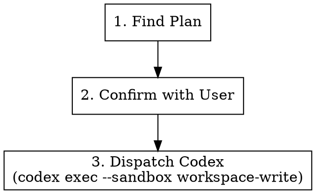

# Execute Plan

## Overview

Takes an existing implementation plan and dispatches Codex (sandboxed `workspace-write`) to execute it. If the plan specifies commit conventions, Codex must follow them.

**Announce at start:** "I'm using the juel:execute skill to implement the plan."

## Strict Execution Protocol (non-negotiable)

<!-- juel:protocol v2 -->

**1. Preflight, then task list, before anything else.** Before any other output and before any tool call, emit the Preflight block (below). If the preflight verdict is STOP, print the preflight block and **stop** — do not create tasks and do not begin work. Otherwise, before any other work, create one task per phase in this skill's `## Phases` list via `TaskCreate` — `subject` is the phase name, `activeForm` is its present-continuous form. This task list, rendered persistently by the harness, IS the checklist; nothing else satisfies this rule. This is not optional on re-invocation, on resume, or when the user says "just do it".

**2. Phases run in order.** No skipping, reordering, or merging. A phase that does not apply is still announced, not dropped: mark its task `completed` via `TaskUpdate`, with the one-line evidence required by rule 3 stating the skip reason (e.g. "SKIPPED: <reason>") — the task list has no separate "skipped" status, so a skipped phase becomes `completed` too. Never begin phase N+1 before phase N's task is marked `completed`.

**3. Report after every phase.** Mark the phase's task `in_progress` via `TaskUpdate` when starting it, then `completed` via `TaskUpdate` when it finishes or is skipped — each transition accompanied by exactly one line of evidence (path written, command run, count found). Do not re-print the checklist as text; the task list is the persistent record and replaces that. Never claim progress in prose alone.

**4. Everything runs in the FOREGROUND; `review-pr`'s agents run in PARALLEL.** This overrides every other instruction in this file and in any skill invoked from it. Foreground/background and parallel/sequential are different axes: foreground vs. background is about whether you wait and watch; parallel vs. sequential is about whether agents run concurrently. The requirement is concurrent-and-watched — dispatched together, run in the foreground, waited on in full.
- `pr-review-toolkit:review-pr`'s agents MUST be dispatched in parallel: pass `all parallel`, or dispatch the agents together in ONE message. Its sequential default — one agent at a time — is the exact slowness this rule exists to prevent; requesting it, or omitting `all parallel`, is a violation.
- `pr-review-toolkit:review-pr`, `simplify`, and `codex exec` are all foreground-only. Invoke every subagent with `run_in_background: false` **explicitly** — the harness backgrounds subagents by default, so omitting the flag is a violation, not a neutral choice. Dispatching agents in parallel does not relax this: each agent in that one message still carries its own explicit `run_in_background: false`.
- Never `&`. Never `run_in_background: true`. Never "dispatch and continue".
- **Never redirect a command's output to a log file.** No `> out.log`, no `| tee`, no writing output somewhere to read back later. The user must be able to watch the run as it happens.
- Read the complete output and state the outcome — finding count, exit status, files changed — before marking the phase done. A summary may follow the raw output; it may never replace it.
- Passing any of this into another session (a CMUX prompt, a nested `claude`) carries these rules with it — say so explicitly in that prompt string.

**5. Confirmation gates stack; they do not replace this.** Where this skill pauses between phases, the checklist report comes first, then the "Proceed to phase N+1?" question. A user's "yes" advances exactly one phase — it never authorizes skipping ahead or batching the remainder.

## Preflight

| Dep | Type | H/S | Check | If missing |
|---|---|---|---|---|
| codex | cli | SOFT | `command -v codex` | execute the plan in-session via superpowers:executing-plans |
| plan file | context | HARD | newest `${docsRoot}/plans/*.md` | STOP → no plan to execute |
| writable workspace | context | HARD | `test -w .` | STOP |

## Phases

[ ] 1. Find the plan
[ ] 2. Confirm the plan path with the user
[ ] 3. Scan the plan for commit conventions and fold them into the executor prompt
[ ] 4. Run the executor in the FOREGROUND and read its full output
[ ] 5. Report the result

## Arguments

| Argument | Default | Description |
|----------|---------|-------------|
| `[plan-path]` | auto-detect | Path to the plan file |

Usage: `/juel:execute` or `/juel:execute ${docsRoot}/plans/2026-03-31-my-feature.md`

## Workflow



### Step 1: Find the Plan

**Resolve `docsRoot` once, then reuse it.** In order:
1. `config.docsRoot`, if set.
2. `<repo-root>/docs/.superpowers/` **if it exists and is non-empty** — an existing repo keeps
   using the dotted path so prior specs, plans and context are never stranded or split.
3. Otherwise `<repo-root>/docs/superpowers/` — canonical for every new repo.

Never pick between the two variants ad hoc. Layout underneath is
`${docsRoot}/{specs,plans,context,findings}/`.

```bash
ROOT=$(git rev-parse --show-toplevel)
# Step 1 of the precedence above (config.docsRoot in .claude/workflow.json /
# .claude/workflow.local.json) — if set there, use that value directly
# instead of the filesystem check below. Steps 2-3 (filesystem fallback):
if [ -d "$ROOT/docs/.superpowers" ] && [ -n "$(ls -A "$ROOT/docs/.superpowers" 2>/dev/null)" ]; then
  docsRoot="$ROOT/docs/.superpowers"
else
  docsRoot="$ROOT/docs/superpowers"
fi
```

(If `.claude/workflow.json` or `.claude/workflow.local.json` sets `docsRoot`, that value wins over
the filesystem check above — config always takes precedence.)

Ensure the repo's `.gitignore` contains unanchored `superpowers/` and `.superpowers/` entries —
unanchored so they match at any depth. Add them if absent. This directory is scratch, not product.

If a plan path was passed as an argument, use that.

Otherwise, search for the most recent plan:

```bash
ls -t "$docsRoot/plans"/*.md | head -1
```

If no plans found, check `$docsRoot/plans/review-plan.md` as fallback.

If still no plan found, tell the user and stop.

### Step 2: Confirm with User

Show the plan file path and ask:

> Found plan: `<path>`. Execute it with Codex?

Wait for user confirmation before proceeding.

### Step 3: Dispatch Codex

Run Codex CLI non-interactively with the workspace-write sandbox:

```bash
codex exec --sandbox workspace-write '$claude-plan-executor <plan-path>'
```

Before dispatching, scan the plan for commit-convention guidance (e.g., Conventional Commits, ticket-scoped messages like `feat(MSTR-1234): ...`, branch naming rules). If found, append an explicit instruction to the Codex prompt:

> Follow the commit conventions specified in the plan: `<quote the relevant rule>`.

If the plan does not specify any commit conventions, do not invent them.

Run this in the **foreground** (`run_in_background: false`). Do not redirect its output to a file — the user watches the executor run. Wait for it to exit, read the complete output, and state the exit status and files changed before marking the phase done.

Wait for Codex to complete.

## Common Mistakes

| Mistake | Fix |
|---------|-----|
| Running without a plan | Always find/confirm the plan first |
| Forgetting `--sandbox workspace-write` | Codex needs write access to apply the plan |
| Ignoring commit conventions in the plan | Always forward them to Codex when present |
| Not waiting for Codex to finish | Must complete before reporting results |
