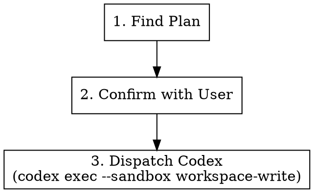

# Execute Plan

## Overview

Takes an existing implementation plan and dispatches Codex (sandboxed `workspace-write`) to execute it. If the plan specifies commit conventions, Codex must follow them.

**Announce at start:** "I'm using the juel:execute skill to implement the plan."

## Strict Execution Protocol (non-negotiable)

<!-- juel:protocol v6 -->

**1. Preflight, then task list, before anything else.** Before any other output and before any tool call, emit the Preflight block (below). If the preflight verdict is STOP, print the preflight block and **stop** — do not create tasks and do not begin work. Otherwise, before any other work, create one task per phase in this skill's `## Phases` list via `TaskCreate` — `subject` is the phase name, `activeForm` is its present-continuous form. This task list, rendered persistently by the harness, IS the checklist; nothing else satisfies this rule. This is not optional on re-invocation, on resume, or when the user says "just do it".
- **If `TaskCreate`/`TaskUpdate` genuinely fail** — one attempted call returns an error, never merely assumed unavailable in advance — fall back to an explicit numbered phase log, printed after every phase transition with the same one-line evidence rule 3 already requires. State the degradation once, in one line, before continuing. Never silently swap to prose without saying so.

**2. Phases run in order.** No skipping, reordering, or merging. A phase that does not apply is still announced, not dropped: mark its task `completed` via `TaskUpdate`, with the one-line evidence required by rule 3 stating the skip reason (e.g. "SKIPPED: <reason>") — the task list has no separate "skipped" status, so a skipped phase becomes `completed` too. Never begin phase N+1 before phase N's task is marked `completed`.

**3. Report after every phase.** Mark the phase's task `in_progress` via `TaskUpdate` when starting it, then `completed` via `TaskUpdate` when it finishes or is skipped — each transition accompanied by exactly one line of evidence (path written, command run, count found). Do not re-print the checklist as text; the task list is the persistent record and replaces that. Never claim progress in prose alone.

**4. `review-pr`'s agents run in PARALLEL and FOREGROUND; `code-simplifier` runs FOREGROUND; `codex exec` runs BACKGROUND, WATCHED, and WAITED-ON.** This overrides every other instruction in this file and in any skill invoked from it. Foreground/background is about whether the tool call blocks; watched is about whether output still streams somewhere the user can see it — these are different axes, and `codex exec` needs the second without the first. `review-pr`'s agents additionally need PARALLEL: dispatched together, not one at a time.
- `pr-review-toolkit:review-pr`'s agents MUST be dispatched in parallel: pass `all parallel`, or dispatch the agents together in ONE message. Its sequential default — one agent at a time — is the exact slowness this rule exists to prevent; requesting it, or omitting `all parallel`, is a violation.
- `pr-review-toolkit:review-pr` and `code-simplifier` are foreground-only. Invoke both with `run_in_background: false` **explicitly** — the harness backgrounds subagents by default, so omitting the flag is a violation, not a neutral choice. Dispatching review-pr's agents in parallel does not relax this: each agent in that one message still carries its own explicit `run_in_background: false`. Never `&`. Never `run_in_background: true` for these two. Never "dispatch and continue".
- `codex exec` runs through the **Bash tool**, whose `timeout` parameter is capped at 600000ms (10 minutes). A real `codex exec` applying a plan routinely runs longer than that, so a foreground dispatch gets silently DETACHED by the harness at the cap regardless of this rule — nothing then watches it, nothing reads its output, and the skill would wrongly proceed as if the phase had ended. `review-pr` and `code-simplifier` run through the **Skill/Agent tool**, which carries no such cap — that is the entire reason only `codex exec` changes. Do not "fix" this back to foreground; the cap is a harness fact, not a preference.
- **Always dispatch `codex exec` with `run_in_background: true`** — not optional, not "if it looks long," always. Omitting the flag, or passing `false`, is a violation.
- **Never redirect a command's output to a log file.** No `> out.log`, no `| tee`, no writing output somewhere to read back later. This applies to all three, and is now MORE load-bearing for `codex exec`: backgrounded with no ceiling, the shell is the only place the user watches it work.
- For `review-pr` and `code-simplifier`: read the complete output and state the outcome — finding count, exit status, files changed — before marking the phase done. A summary may follow the raw output; it may never replace it.
- For `codex exec`: wait for it to exit before marking the phase done — backgrounding must never become fire-and-forget. Then state the outcome — exit status, files changed — not a transcript; the user already watched it stream in the shell, so its full output is never printed back into the conversation.
- **Never attach a `Monitor` or a polling loop to `codex exec`.** No `Monitor` armed on its output, no repeated reads of the `.output` file, no `tail -f`. Dispatch it backgrounded and wait for the completion notification — the user already watches it stream in their own shell, which is exactly why output must never be redirected; a watcher on top adds nothing, and a filter with no pattern for `Reading additional input from stdin...` will misread a stalled executor as healthy.
- Passing any of this into another session (a CMUX prompt, a nested `claude`) carries these rules with it — say so explicitly in that prompt string.

**5. Confirmation gates stack; they do not replace this.** Where this skill pauses between phases, the checklist report comes first, then the "Proceed to phase N+1?" question. A user's "yes" advances exactly one phase — it never authorizes skipping ahead or batching the remainder.

**6. `Idling` is a status, not a verdict — never read it as "returned nothing."** When a dispatched `pr-review-toolkit:review-pr` agent or `code-simplifier` shows `Idling` (or any non-streaming status) in the harness's agent view while its call is still in flight, that status alone never means the agent produced no output — `Idling` covers both "still working" and "finished, with a result already available but not yet consumed by this session" indistinguishably. Multi-agent dispatch is exactly where this bites: `pr-review-toolkit:review-pr`'s specialist agents run "all parallel" (rule 4), so several can sit at `Idling` simultaneously while one has already returned and the others haven't.
- **Before concluding a dispatch returned nothing, or re-dispatching it, check `ListAgents` for the agent by name.** If it's listed with a result available, read that result directly — do not wait further and do not re-dispatch a duplicate call.
- **Never re-dispatch `pr-review-toolkit:review-pr` or `code-simplifier` "to unstick it"** without first confirming via `ListAgents` that the original dispatch genuinely produced nothing — re-dispatching a call whose result already exists wastes a full review cycle and risks duplicate, conflicting findings.
- **Never go quiet past a check-in point with no status update.** If a dispatch has been running long enough that you would normally report progress, either report genuine progress or check `ListAgents` first — silently waiting while a subagent is actually done is the exact failure this rule exists to prevent.

## Preflight

| Dep | Type | H/S | Check | If missing |
|---|---|---|---|---|
| codex | cli | SOFT | `command -v codex` | execute the plan in-session via superpowers:executing-plans |
| plan file | context | HARD | newest `${docsRoot}/plans/*.md` | STOP → no plan to execute |
| writable workspace | context | HARD | `test -w .` | STOP |

## Phases

This list is the source for `TaskCreate`: one task per phase, `subject` is the phase name, `activeForm` is its present-continuous form, all created before any other work.

1. Find the plan
2. Confirm the plan path with the user
3. Scan the plan for commit conventions and fold them into the executor prompt
4. Run the executor in the BACKGROUND (watched, waited-on) and report the outcome
5. Report the result

## Arguments

| Argument | Default | Description |
|----------|---------|-------------|
| `[plan-path]` | auto-detect | Path to the plan file |

Usage: `/juel:execute` or `/juel:execute ${docsRoot}/plans/2026-03-31-my-feature.md`

## Workflow



### Step 1: Find the Plan

**Resolve `docsRoot` once, then reuse it.** In order:
1. `config.docsRoot`, if set.
2. `<repo-root>/docs/.superpowers/` **if it exists and is non-empty** — an existing repo keeps
   using the dotted path so prior specs, plans and context are never stranded or split.
3. Otherwise `<repo-root>/docs/superpowers/` — canonical for every new repo.

Never pick between the two variants ad hoc. Layout underneath is
`${docsRoot}/{specs,plans,context,findings}/`.

```bash
ROOT=$(git rev-parse --show-toplevel)
# Step 1 of the precedence above (config.docsRoot in .claude/workflow.json /
# .claude/workflow.local.json) — if set there, use that value directly
# instead of the filesystem check below. Steps 2-3 (filesystem fallback):
if [ -d "$ROOT/docs/.superpowers" ] && [ -n "$(ls -A "$ROOT/docs/.superpowers" 2>/dev/null)" ]; then
  docsRoot="$ROOT/docs/.superpowers"
else
  docsRoot="$ROOT/docs/superpowers"
fi
```

(If `.claude/workflow.json` or `.claude/workflow.local.json` sets `docsRoot`, that value wins over
the filesystem check above — config always takes precedence.)

Ensure the repo's `.gitignore` contains unanchored `superpowers/` and `.superpowers/` entries —
unanchored so they match at any depth. Add them if absent. This directory is scratch, not product.

**Never overwrite an existing file under `${docsRoot}`.** On a name collision — a spec, plan,
findings report, or context file that already exists at the derived path — append `-v2` before
the extension; if `-v2` exists too, use `-v3`, and so on. This applies to every file type written
under `${docsRoot}`, not only the one this skill produces.

If a plan path was passed as an argument, use that.

Otherwise, search for the most recent plan:

```bash
ls -t "$docsRoot/plans"/*.md | head -1
```

If no plans found, check `$docsRoot/plans/review-plan.md` as fallback.

If still no plan found, tell the user and stop.

### Step 2: Confirm with User

Show the plan file path and ask:

> Found plan: `<path>`. Execute it with Codex?

Wait for user confirmation before proceeding.

### Step 3: Dispatch Codex

Run Codex CLI non-interactively with the workspace-write sandbox:

The harness pipes stdin and never closes it, so codex waits for an EOF that never arrives, and without `< /dev/null` here it hangs silently with the prompt unprocessed.

```bash
codex exec --sandbox workspace-write '$claude-plan-executor <plan-path>' < /dev/null
```

Before dispatching, scan the plan for commit-convention guidance (e.g., Conventional Commits, ticket-scoped messages like `feat(MSTR-1234): ...`, branch naming rules). If found, append an explicit instruction to the Codex prompt:

> Follow the commit conventions specified in the plan: `<quote the relevant rule>`.

If the plan does not specify any commit conventions, do not invent them.

Always run this in the **background** (`run_in_background: true`) — `codex exec` runs through the Bash tool, whose 600s timeout cap would otherwise silently detach it mid-run. Do not redirect its output to a file — the user watches the executor run in the shell. Wait for it to exit, then state the exit status and files changed before marking the phase done — do not print its full output back into the conversation.

Wait for Codex to complete before marking this phase done.

## Common Mistakes

| Mistake | Fix |
|---------|-----|
| Running without a plan | Always find/confirm the plan first |
| Forgetting `--sandbox workspace-write` | Codex needs write access to apply the plan |
| Ignoring commit conventions in the plan | Always forward them to Codex when present |
| Not waiting for Codex to finish | Must complete before reporting results |
