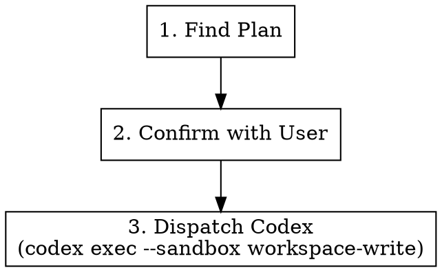

# Execute Plan

## Overview

Takes an existing implementation plan and dispatches Codex (sandboxed `workspace-write`) to execute it. If the plan specifies commit conventions, Codex must follow them.

**Announce at start:** "I'm using the juel:execute skill to implement the plan."

## Strict Execution Protocol (non-negotiable)

<!-- juel:protocol v1 -->

**1. Preflight, then checklist, before anything else.** Before any other output and before any tool call, emit the Preflight block (below), then this skill's `## Phases` checklist rendered as:

```
<skill-name> — N phases
[ ] 1. <phase name>
[ ] 2. <phase name>
```

If the preflight verdict is STOP, print the preflight block and **stop** — do not print the checklist and do not begin work. Otherwise no work begins until the checklist is on screen. This is not optional on re-invocation, on resume, or when the user says "just do it".

**2. Phases run in order.** No skipping, reordering, or merging. A phase that does not apply is still announced: mark it `[-] N. <name> — SKIPPED: <one-line reason>` and continue at N+1. Never drop a phase silently. Never begin phase N+1 before phase N is marked done or skipped.

**3. Report after every phase.** Re-emit the checklist (`[x]` done, `[-]` skipped, `[ ]` pending) plus one line of evidence for the phase just finished — path written, command run, count found. Never claim progress in prose alone.

**4. Everything runs in the FOREGROUND.** This overrides every other instruction in this file and in any skill invoked from it.
- `pr-review-toolkit:review-pr`, `simplify`, and `codex exec` are all foreground-only. Invoke subagents with `run_in_background: false` **explicitly** — the harness backgrounds subagents by default, so omitting the flag is a violation, not a neutral choice.
- Never `&`. Never `run_in_background: true`. Never "dispatch and continue".
- **Never redirect a command's output to a log file.** No `> out.log`, no `| tee`, no writing output somewhere to read back later. The user must be able to watch the run as it happens.
- Do not request `review-pr`'s parallel / `all parallel` mode.
- Read the complete output and state the outcome — finding count, exit status, files changed — before marking the phase done. A summary may follow the raw output; it may never replace it.
- Passing any of this into another session (a CMUX prompt, a nested `claude`) carries these rules with it — say so explicitly in that prompt string.

**5. Confirmation gates stack; they do not replace this.** Where this skill pauses between phases, the checklist report comes first, then the "Proceed to phase N+1?" question. A user's "yes" advances exactly one phase — it never authorizes skipping ahead or batching the remainder.

## Preflight

| Dep | Type | H/S | Check | If missing |
|---|---|---|---|---|
| codex | cli | SOFT | `command -v codex` | execute the plan in-session via superpowers:executing-plans |
| plan file | context | HARD | newest `${docsRoot}/plans/*.md` | STOP → no plan to execute |
| writable workspace | context | HARD | `test -w .` | STOP |

## Phases

[ ] 1. Find the plan
[ ] 2. Confirm the plan path with the user
[ ] 3. Scan the plan for commit conventions and fold them into the executor prompt
[ ] 4. Run the executor in the FOREGROUND and read its full output
[ ] 5. Report the result

## Arguments

| Argument | Default | Description |
|----------|---------|-------------|
| `[plan-path]` | auto-detect | Path to the plan file |

Usage: `/juel:execute` or `/juel:execute docs/.superpowers/plans/2026-03-31-my-feature.md`

## Workflow



### Step 1: Find the Plan

If a plan path was passed as an argument, use that.

Otherwise, search for the most recent plan:

```bash
ls -t docs/.superpowers/plans/*.md | head -1
```

If no plans found, check `docs/.superpowers/review-plan.md` as fallback.

If still no plan found, tell the user and stop.

### Step 2: Confirm with User

Show the plan file path and ask:

> Found plan: `<path>`. Execute it with Codex?

Wait for user confirmation before proceeding.

### Step 3: Dispatch Codex

Run Codex CLI non-interactively with the workspace-write sandbox:

```bash
codex exec --sandbox workspace-write '$claude-plan-executor <plan-path>'
```

Before dispatching, scan the plan for commit-convention guidance (e.g., Conventional Commits, ticket-scoped messages like `feat(MSTR-1234): ...`, branch naming rules). If found, append an explicit instruction to the Codex prompt:

> Follow the commit conventions specified in the plan: `<quote the relevant rule>`.

If the plan does not specify any commit conventions, do not invent them.

Run this in the **foreground** (`run_in_background: false`). Do not redirect its output to a file — the user watches the executor run. Wait for it to exit, read the complete output, and state the exit status and files changed before marking the phase done.

Wait for Codex to complete.

## Common Mistakes

| Mistake | Fix |
|---------|-----|
| Running without a plan | Always find/confirm the plan first |
| Forgetting `--sandbox workspace-write` | Codex needs write access to apply the plan |
| Ignoring commit conventions in the plan | Always forward them to Codex when present |
| Not waiting for Codex to finish | Must complete before reporting results |
