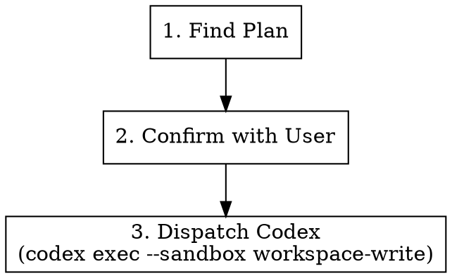

# Execute Plan

## Overview

Takes an existing implementation plan and dispatches Codex (sandboxed `workspace-write`) to execute it. If the plan specifies commit conventions, Codex must follow them.

**Announce at start:** "I'm using the juel:execute skill to implement the plan."

## Arguments

| Argument | Default | Description |
|----------|---------|-------------|
| `[plan-path]` | auto-detect | Path to the plan file |

Usage: `/juel:execute` or `/juel:execute docs/.superpowers/plans/2026-03-31-my-feature.md`

## Workflow



### Step 1: Find the Plan

If a plan path was passed as an argument, use that.

Otherwise, search for the most recent plan:

```bash
ls -t docs/.superpowers/plans/*.md | head -1
```

If no plans found, check `docs/.superpowers/review-plan.md` as fallback.

If still no plan found, tell the user and stop.

### Step 2: Confirm with User

Show the plan file path and ask:

> Found plan: `<path>`. Execute it with Codex?

Wait for user confirmation before proceeding.

### Step 3: Dispatch Codex

Run Codex CLI non-interactively with the workspace-write sandbox:

```bash
codex exec --sandbox workspace-write '$claude-plan-executor <plan-path>'
```

Before dispatching, scan the plan for commit-convention guidance (e.g., Conventional Commits, ticket-scoped messages like `feat(MSTR-1234): ...`, branch naming rules). If found, append an explicit instruction to the Codex prompt:

> Follow the commit conventions specified in the plan: `<quote the relevant rule>`.

If the plan does not specify any commit conventions, do not invent them.

Run this in the background. Announce to the user that Codex has been dispatched.

Wait for Codex to complete.

## Common Mistakes

| Mistake | Fix |
|---------|-----|
| Running without a plan | Always find/confirm the plan first |
| Forgetting `--sandbox workspace-write` | Codex needs write access to apply the plan |
| Ignoring commit conventions in the plan | Always forward them to Codex when present |
| Not waiting for Codex to finish | Must complete before reporting results |
