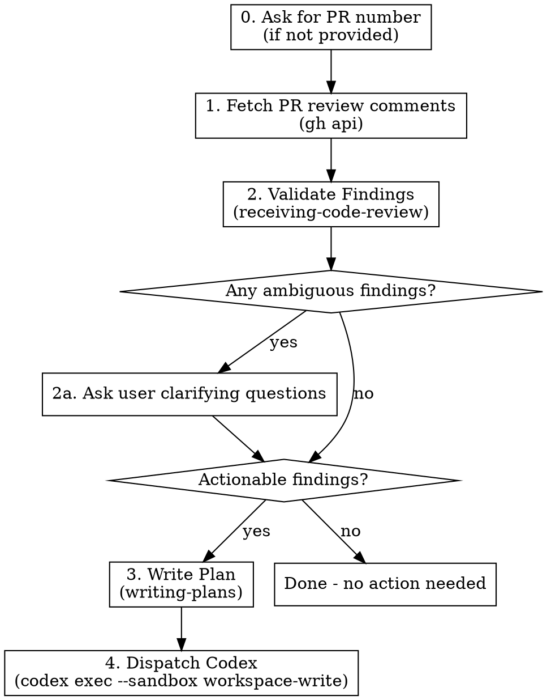

# Receive Review and Execute

## Overview

Orchestrates a receive-review-to-fix cycle for an **existing PR with review comments**: fetch PR comments → validate findings → clarify ambiguities with the user → write remediation plan → dispatch Codex to execute.

Differs from `/juel:review-and-execute`: that one runs a fresh PR review locally; this one consumes review comments already posted on a GitHub PR.

**Announce at start:** "I'm using the receive-review-and-execute skill to apply PR review feedback."

## Strict Execution Protocol (non-negotiable)

<!-- juel:protocol v7 -->

**0. Harness check, before every other rule.** If you do not have the `TaskCreate` tool, you are not running in Claude Code. Read `references/harness-codex.md`, resolved relative to this skill file's own location (`../../references/harness-codex.md`), and apply its construct map, corrected facts, dependency substitutions and degradation contract to every rule below and to every phase body in this skill. This single read is the one action permitted before rule 1's preflight, and only in that case. If you do have `TaskCreate`, ignore that file entirely and continue to rule 1.

**1. Preflight, then task list, before anything else.** Before any other output and before any tool call, emit the Preflight block (below). If the preflight verdict is STOP, print the preflight block and **stop** — do not create tasks and do not begin work. Otherwise, before any other work, create one task per phase in this skill's `## Phases` list via `TaskCreate` — `subject` is the phase name, `activeForm` is its present-continuous form. This task list, rendered persistently by the harness, IS the checklist; nothing else satisfies this rule. This is not optional on re-invocation, on resume, or when the user says "just do it".
- **If `TaskCreate`/`TaskUpdate` genuinely fail** — one attempted call returns an error, never merely assumed unavailable in advance — fall back to an explicit numbered phase log, printed after every phase transition with the same one-line evidence rule 3 already requires. State the degradation once, in one line, before continuing. Never silently swap to prose without saying so.

**2. Phases run in order.** No skipping, reordering, or merging. A phase that does not apply is still announced, not dropped: mark its task `completed` via `TaskUpdate`, with the one-line evidence required by rule 3 stating the skip reason (e.g. "SKIPPED: <reason>") — the task list has no separate "skipped" status, so a skipped phase becomes `completed` too. Never begin phase N+1 before phase N's task is marked `completed`.

**3. Report after every phase.** Mark the phase's task `in_progress` via `TaskUpdate` when starting it, then `completed` via `TaskUpdate` when it finishes or is skipped — each transition accompanied by exactly one line of evidence (path written, command run, count found). Do not re-print the checklist as text; the task list is the persistent record and replaces that. Never claim progress in prose alone.

**4. `review-pr`'s agents run in PARALLEL and FOREGROUND; `code-simplifier` runs FOREGROUND; `codex exec` runs BACKGROUND, WATCHED, and WAITED-ON.** This overrides every other instruction in this file and in any skill invoked from it. Foreground/background is about whether the tool call blocks; watched is about whether output still streams somewhere the user can see it — these are different axes, and `codex exec` needs the second without the first. `review-pr`'s agents additionally need PARALLEL: dispatched together, not one at a time.
- `pr-review-toolkit:review-pr`'s agents MUST be dispatched in parallel: pass `all parallel`, or dispatch the agents together in ONE message. Its sequential default — one agent at a time — is the exact slowness this rule exists to prevent; requesting it, or omitting `all parallel`, is a violation.
- `pr-review-toolkit:review-pr` and `code-simplifier` are foreground-only. Invoke both with `run_in_background: false` **explicitly** — the harness backgrounds subagents by default, so omitting the flag is a violation, not a neutral choice. Dispatching review-pr's agents in parallel does not relax this: each agent in that one message still carries its own explicit `run_in_background: false`. Never `&`. Never `run_in_background: true` for these two. Never "dispatch and continue".
- `codex exec` runs through the **Bash tool**, whose `timeout` parameter is capped at 600000ms (10 minutes). A real `codex exec` applying a plan routinely runs longer than that, so a foreground dispatch gets silently DETACHED by the harness at the cap regardless of this rule — nothing then watches it, nothing reads its output, and the skill would wrongly proceed as if the phase had ended. `review-pr` and `code-simplifier` run through the **Skill/Agent tool**, which carries no such cap — that is the entire reason only `codex exec` changes. Do not "fix" this back to foreground; the cap is a harness fact, not a preference.
- **Always dispatch `codex exec` with `run_in_background: true`** — not optional, not "if it looks long," always. Omitting the flag, or passing `false`, is a violation.
- **Never redirect a command's output to a log file.** No `> out.log`, no `| tee`, no writing output somewhere to read back later. This applies to all three, and is now MORE load-bearing for `codex exec`: backgrounded with no ceiling, the shell is the only place the user watches it work.
- For `review-pr` and `code-simplifier`: read the complete output and state the outcome — finding count, exit status, files changed — before marking the phase done. A summary may follow the raw output; it may never replace it.
- For `codex exec`: wait for it to exit before marking the phase done — backgrounding must never become fire-and-forget. Then state the outcome — exit status, files changed — not a transcript; the user already watched it stream in the shell, so its full output is never printed back into the conversation.
- **Never attach a `Monitor` or a polling loop to `codex exec`.** No `Monitor` armed on its output, no repeated reads of the `.output` file, no `tail -f`. Dispatch it backgrounded and wait for the completion notification — the user already watches it stream in their own shell, which is exactly why output must never be redirected; a watcher on top adds nothing, and a filter with no pattern for `Reading additional input from stdin...` will misread a stalled executor as healthy.
- Passing any of this into another session (a CMUX prompt, a nested `claude`) carries these rules with it — say so explicitly in that prompt string.

**5. Confirmation gates stack; they do not replace this.** Where this skill pauses between phases, the checklist report comes first, then the "Proceed to phase N+1?" question. A user's "yes" advances exactly one phase — it never authorizes skipping ahead or batching the remainder.

**6. `Idling` is a status, not a verdict — never read it as "returned nothing."** When a dispatched `pr-review-toolkit:review-pr` agent or `code-simplifier` shows `Idling` (or any non-streaming status) in the harness's agent view while its call is still in flight, that status alone never means the agent produced no output — `Idling` covers both "still working" and "finished, with a result already available but not yet consumed by this session" indistinguishably. Multi-agent dispatch is exactly where this bites: `pr-review-toolkit:review-pr`'s specialist agents run "all parallel" (rule 4), so several can sit at `Idling` simultaneously while one has already returned and the others haven't.
- **Before concluding a dispatch returned nothing, or re-dispatching it, check `ListAgents` for the agent by name.** If it's listed with a result available, read that result directly — do not wait further and do not re-dispatch a duplicate call.
- **Never re-dispatch `pr-review-toolkit:review-pr` or `code-simplifier` "to unstick it"** without first confirming via `ListAgents` that the original dispatch genuinely produced nothing — re-dispatching a call whose result already exists wastes a full review cycle and risks duplicate, conflicting findings.
- **Never go quiet past a check-in point with no status update.** If a dispatch has been running long enough that you would normally report progress, either report genuine progress or check `ListAgents` first — silently waiting while a subagent is actually done is the exact failure this rule exists to prevent.

## Preflight

| Dep | Type | H/S | Check | If missing |
|---|---|---|---|---|
| gh (authenticated) | cli | HARD | `gh auth status` | STOP → `gh auth login` |
| open PR + number | context | HARD | `gh pr view <N> --json number` | STOP → this skill consumes an existing PR |
| GitHub remote | context | HARD | `git remote get-url <remote>` matches github.com | STOP → non-GitHub remotes are unsupported here |
| superpowers | skill | HARD | ships as a plugin dependency | STOP |
| codex | cli | SOFT | `command -v codex` | execute the plan in-session |
| AskUserQuestion | context | HARD | always available interactively | STOP in headless sessions |

## Phases

This list is the source for `TaskCreate`: one task per phase, `subject` is the phase name, `activeForm` is its present-continuous form, all created before any other work.

1. Ensure a PR number, asking if it was not supplied
2. Read every review thread and deliver the summary before forming an opinion
3. Fetch structured data — inline comments, reviews, issue comments, diff
4. Validate findings into actionable / rejected / ambiguous
5. Clarify ambiguous findings (SKIPPED if none were ambiguous)
6. Write the remediation plan, or stop here if there are zero actionable findings
7. Run the executor on the plan, BACKGROUND (watched, waited-on)
8. Report the result

## First action (non-negotiable)

When asked to review a PR, your **first action is always**:

1. Run `gh pr view <num> --comments`
2. Read every existing comment and review thread in full
3. Summarize what's already been raised before forming your own opinion

Do not skim. Do not skip to validation. Do not form opinions before this summary. The summary is delivered to the user before any further step.

For **code-simplifier passes** in this flow (if invoked): read the last 3 commits (`git log -3 --stat`) and ask the user to confirm scope before changing anything.

## Arguments

| Argument | Default | Description |
|----------|---------|-------------|
| `[pr-number]` | (required) | GitHub PR number to fetch review comments from |

Usage: `/juel:receive-review-and-execute 123`

If no PR number is provided, ask the user for it before proceeding. Do not guess.

## Workflow



### Step 0: Ensure PR number

If the user did not supply a PR number, ask:

> "Which PR number should I receive review feedback from?"

Do not proceed until you have a valid integer PR number.

### Step 1: Fetch PR review comments

**Start with `gh pr view <PR> --comments`** to read every existing comment and review thread, then write a short summary of what reviewers have already raised. Deliver that summary to the user before continuing.

Then pull structured data:

```bash
# Repo context
repo=$(gh repo view --json nameWithOwner -q .nameWithOwner)

# Inline review comments (file/line specific)
gh api "repos/$repo/pulls/<PR>/comments" --paginate

# PR-level reviews (overall summaries / approvals)
gh api "repos/$repo/pulls/<PR>/reviews" --paginate

# Issue-style comments on the PR (general discussion)
gh api "repos/$repo/issues/<PR>/comments" --paginate
```

Capture: comment id, author, file path, line, diff hunk, body, created_at. Group by file for readability.

Also fetch the PR diff so validation can ground findings against actual code:

```bash
gh pr diff <PR>
```

### Step 2: Validate Findings

Invoke the receiving-code-review skill:

```
Skill("superpowers:receiving-code-review")
```

For each comment from step 1:
- Verify the finding against the current code on the PR branch
- Reject suggestions that are incorrect, outdated (already fixed), or unnecessary
- Classify each finding as: **actionable**, **rejected**, or **ambiguous**

### Step 2a: Clarify ambiguous findings

If any findings are **ambiguous** (intent unclear, multiple valid interpretations, scope uncertain, or trade-off requires user judgment), STOP and ask the user before writing the plan.

Use `AskUserQuestion` with the specific ambiguous finding(s). For each ambiguity, present:
- The original comment (author + body, trimmed)
- File and line
- Why it is ambiguous
- 2-4 concrete options the user can pick

Do not invent an interpretation. Do not proceed to step 3 until every ambiguity is resolved or explicitly deferred.

After clarification, fold the user's answers into the actionable list.

### Step 3: Write Remediation Plan

**Resolve `docsRoot` once, then reuse it.** In order:
1. `config.docsRoot`, if set.
2. `<repo-root>/docs/.superpowers/` **if it exists and is non-empty** — an existing repo keeps
   using the dotted path so prior specs, plans and context are never stranded or split.
3. Otherwise `<repo-root>/docs/superpowers/` — canonical for every new repo.

Never pick between the two variants ad hoc. Layout underneath is
`${docsRoot}/{specs,plans,context,findings}/`.

```bash
ROOT=$(git rev-parse --show-toplevel)
# Step 1 of the precedence above (config.docsRoot in .claude/workflow.json /
# .claude/workflow.local.json) — if set there, use that value directly
# instead of the filesystem check below. Steps 2-3 (filesystem fallback):
if [ -d "$ROOT/docs/.superpowers" ] && [ -n "$(ls -A "$ROOT/docs/.superpowers" 2>/dev/null)" ]; then
  docsRoot="$ROOT/docs/.superpowers"
else
  docsRoot="$ROOT/docs/superpowers"
fi
```

(If `.claude/workflow.json` or `.claude/workflow.local.json` sets `docsRoot`, that value wins over
the filesystem check above — config always takes precedence.)

Ensure the repo's `.gitignore` contains unanchored `superpowers/` and `.superpowers/` entries —
unanchored so they match at any depth. Add them if absent. This directory is scratch, not product.

**Never overwrite an existing file under `${docsRoot}`.** On a name collision — a spec, plan,
findings report, or context file that already exists at the derived path — append `-v2` before
the extension; if `-v2` exists too, use `-v3`, and so on. This applies to every file type written
under `${docsRoot}`, not only the one this skill produces.

If there are NO actionable findings after validation and clarification, announce this and stop. Do not proceed.

Otherwise invoke writing-plans:

```
Skill("superpowers:writing-plans")
```

Write the resulting plan to: `${docsRoot}/plans/receive-review-plan.md`.

**Never overwrite an existing plan file.** If `receive-review-plan.md` already exists, write the new plan to the next available versioned suffix: `receive-review-plan-v2.md`, then `-v3.md`, etc. Prior plan files are historical records — leave them in place.

Determine the next suffix with:

```bash
ls "$docsRoot/plans"/receive-review-plan*.md 2>/dev/null
```

Then pass the chosen path to Codex in Step 4.

The plan must:
- Reference each confirmed finding (link to the GitHub comment URL)
- Include file paths and line numbers
- Note user decisions for previously ambiguous findings
- Have bite-sized, executable steps
- Include verification commands per task

### Step 4: Dispatch Codex

Run Codex CLI non-interactively with the workspace-write sandbox:

The harness pipes stdin and never closes it, so codex waits for an EOF that never arrives, and without `< /dev/null` here it hangs silently with the prompt unprocessed.

```bash
codex exec --sandbox workspace-write '$claude-plan-executor ${docsRoot}/plans/receive-review-plan<-vN if applicable>.md' < /dev/null
```

**Under Codex (rule 0 applies).** Do not run the command above — it would spawn a second Codex
session inside this one. Instead `spawn_agent` with the plan path as the task, then `wait` for
it. Report the same outcome the Claude path reports: exit status and files changed, never a
transcript. If `spawn_agent` is unavailable (the `multi_agent` feature is off), say so in one
line and apply the plan in this session directly rather than falling back to `codex exec`.

Always run this in the **background** (`run_in_background: true`) — `codex exec` runs through the Bash tool, whose 600s timeout cap would otherwise silently detach it mid-run. Do not redirect its output to a file — the user watches the executor run in the shell. Announce to the user that Codex has been dispatched and surface the command.

Wait for Codex to complete, then state the exit status and files changed before marking the phase done — do not print its full output back into the conversation.

## Common Mistakes

| Mistake | Fix |
|---------|-----|
| Proceeding without a PR number | Step 0 — ask, do not guess |
| Acting on every PR comment blindly | Step 2 — validate before accepting |
| Guessing reviewer intent on ambiguous comments | Step 2a — ask the user explicitly |
| Skipping the plan and going straight to Codex | Codex needs a structured plan |
| Writing plan without file paths/line numbers/comment URLs | Codex needs specifics; reviewer needs traceability |
| Fixing findings directly instead of writing a plan | NEVER fix code yourself — always plan + dispatch Codex |
| Treating already-fixed comments as actionable | Verify against current PR HEAD before accepting |
| Forming an opinion before reading existing comments | Run `gh pr view <num> --comments` first, summarize, then think |
| code-simplifier pass without scope confirmation | Read last 3 commits, ask user to confirm scope before edits |
| Running the executor in the foreground, or redirecting its output to a file | Never. Phase 7 always backgrounds Codex (600s Bash-tool cap) but never redirects its output — the user watches it in the shell. |
| Backgrounding Codex and moving on without waiting for it to exit | Never. Background is not fire-and-forget — wait for exit, then report the outcome. |
| Forgetting `--sandbox workspace-write` | Codex needs write access to apply the plan |
| Overwriting an existing `receive-review-plan.md` | Always pick the next free `-vN` suffix; prior plans are historical |
