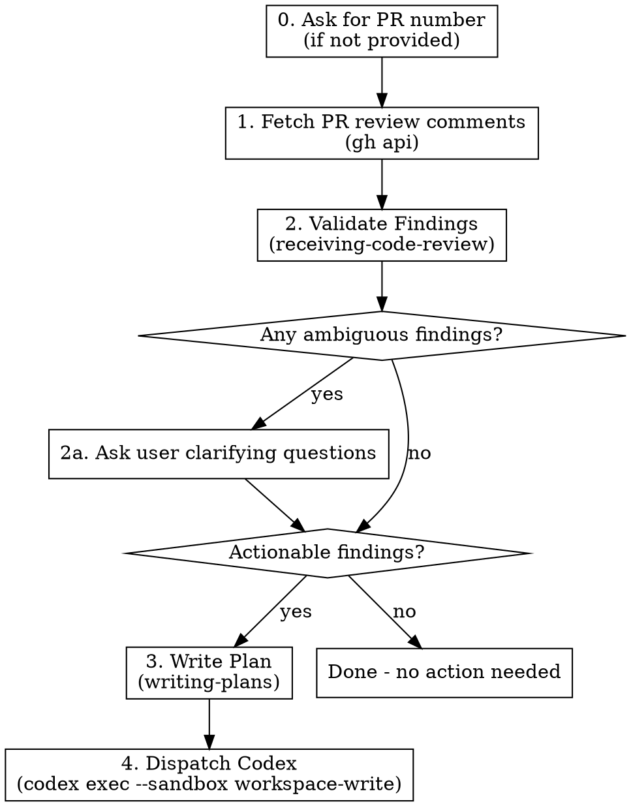

# Receive Review and Execute

## Overview

Orchestrates a receive-review-to-fix cycle for an **existing PR with review comments**: fetch PR comments → validate findings → clarify ambiguities with the user → write remediation plan → dispatch Codex to execute.

Differs from `/juel:review-and-execute`: that one runs a fresh PR review locally; this one consumes review comments already posted on a GitHub PR.

**Announce at start:** "I'm using the receive-review-and-execute skill to apply PR review feedback."

## First action (non-negotiable)

When asked to review a PR, your **first action is always**:

1. Run `gh pr view <num> --comments`
2. Read every existing comment and review thread in full
3. Summarize what's already been raised before forming your own opinion

Do not skim. Do not skip to validation. Do not form opinions before this summary. The summary is delivered to the user before any further step.

For **simplify passes** in this flow (if invoked): read the last 3 commits (`git log -3 --stat`) and ask the user to confirm scope before changing anything.

## Arguments

| Argument | Default | Description |
|----------|---------|-------------|
| `[pr-number]` | (required) | GitHub PR number to fetch review comments from |

Usage: `/juel:receive-review-and-execute 123`

If no PR number is provided, ask the user for it before proceeding. Do not guess.

## Workflow



### Step 0: Ensure PR number

If the user did not supply a PR number, ask:

> "Which PR number should I receive review feedback from?"

Do not proceed until you have a valid integer PR number.

### Step 1: Fetch PR review comments

**Start with `gh pr view <PR> --comments`** to read every existing comment and review thread, then write a short summary of what reviewers have already raised. Deliver that summary to the user before continuing.

Then pull structured data:

```bash
# Repo context
repo=$(gh repo view --json nameWithOwner -q .nameWithOwner)

# Inline review comments (file/line specific)
gh api "repos/$repo/pulls/<PR>/comments" --paginate

# PR-level reviews (overall summaries / approvals)
gh api "repos/$repo/pulls/<PR>/reviews" --paginate

# Issue-style comments on the PR (general discussion)
gh api "repos/$repo/issues/<PR>/comments" --paginate
```

Capture: comment id, author, file path, line, diff hunk, body, created_at. Group by file for readability.

Also fetch the PR diff so validation can ground findings against actual code:

```bash
gh pr diff <PR>
```

### Step 2: Validate Findings

Invoke the receiving-code-review skill:

```
Skill("superpowers:receiving-code-review")
```

For each comment from step 1:
- Verify the finding against the current code on the PR branch
- Reject suggestions that are incorrect, outdated (already fixed), or unnecessary
- Classify each finding as: **actionable**, **rejected**, or **ambiguous**

### Step 2a: Clarify ambiguous findings

If any findings are **ambiguous** (intent unclear, multiple valid interpretations, scope uncertain, or trade-off requires user judgment), STOP and ask the user before writing the plan.

Use `AskUserQuestion` with the specific ambiguous finding(s). For each ambiguity, present:
- The original comment (author + body, trimmed)
- File and line
- Why it is ambiguous
- 2-4 concrete options the user can pick

Do not invent an interpretation. Do not proceed to step 3 until every ambiguity is resolved or explicitly deferred.

After clarification, fold the user's answers into the actionable list.

### Step 3: Write Remediation Plan

If there are NO actionable findings after validation and clarification, announce this and stop. Do not proceed.

Otherwise invoke writing-plans:

```
Skill("superpowers:writing-plans")
```

Write the resulting plan to: `docs/.superpowers/receive-review-plan.md`.

**Never overwrite an existing plan file.** If `receive-review-plan.md` already exists, write the new plan to the next available versioned suffix: `receive-review-plan-v2.md`, then `-v3.md`, etc. Prior plan files are historical records — leave them in place.

Determine the next suffix with:

```bash
ls docs/.superpowers/receive-review-plan*.md 2>/dev/null
```

Then pass the chosen path to Codex in Step 4.

The plan must:
- Reference each confirmed finding (link to the GitHub comment URL)
- Include file paths and line numbers
- Note user decisions for previously ambiguous findings
- Have bite-sized, executable steps
- Include verification commands per task

### Step 4: Dispatch Codex

Run Codex CLI non-interactively with the workspace-write sandbox:

```bash
codex exec --sandbox workspace-write '$claude-plan-executor docs/.superpowers/receive-review-plan<-vN if applicable>.md'
```

Run this in the background (Bash tool with `run_in_background: true`). Announce to the user that Codex has been dispatched and surface the command.

Wait for Codex to complete before reporting results.

## Common Mistakes

| Mistake | Fix |
|---------|-----|
| Proceeding without a PR number | Step 0 — ask, do not guess |
| Acting on every PR comment blindly | Step 2 — validate before accepting |
| Guessing reviewer intent on ambiguous comments | Step 2a — ask the user explicitly |
| Skipping the plan and going straight to Codex | Codex needs a structured plan |
| Writing plan without file paths/line numbers/comment URLs | Codex needs specifics; reviewer needs traceability |
| Fixing findings directly instead of writing a plan | NEVER fix code yourself — always plan + dispatch Codex |
| Treating already-fixed comments as actionable | Verify against current PR HEAD before accepting |
| Forming an opinion before reading existing comments | Run `gh pr view <num> --comments` first, summarize, then think |
| Simplify pass without scope confirmation | Read last 3 commits, ask user to confirm scope before edits |
| Running Codex in foreground | Step 4 — dispatch with `run_in_background: true` |
| Forgetting `--sandbox workspace-write` | Codex needs write access to apply the plan |
| Overwriting an existing `receive-review-plan.md` | Always pick the next free `-vN` suffix; prior plans are historical |
