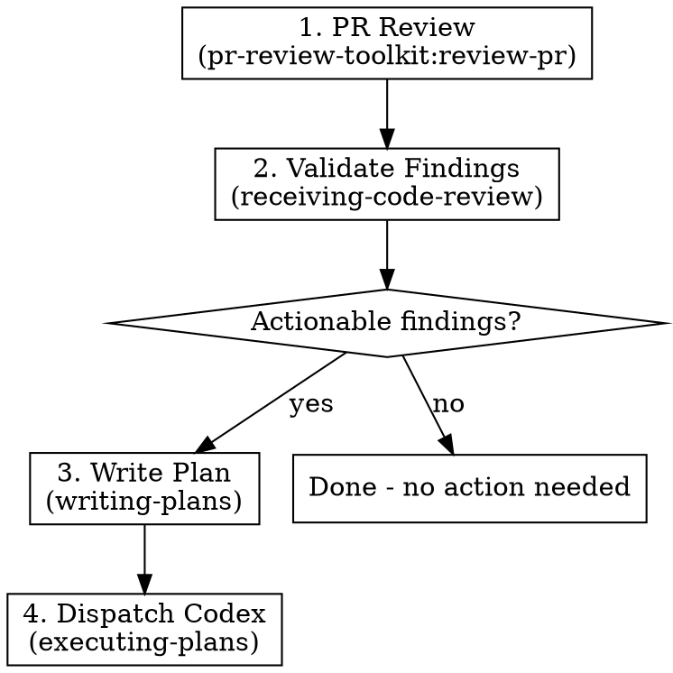

# Review and Execute

## Overview

Orchestrates a full review-to-fix cycle: PR review → validate findings → write remediation plan → dispatch Codex to execute.

**Announce at start:** "I'm using the review-and-execute skill to review and remediate changes."

## Strict Execution Protocol (non-negotiable)

<!-- juel:protocol v1 -->

**1. Preflight, then checklist, before anything else.** Before any other output and before any tool call, emit the Preflight block (below), then this skill's `## Phases` checklist rendered as:

```
<skill-name> — N phases
[ ] 1. <phase name>
[ ] 2. <phase name>
```

If the preflight verdict is STOP, print the preflight block and **stop** — do not print the checklist and do not begin work. Otherwise no work begins until the checklist is on screen. This is not optional on re-invocation, on resume, or when the user says "just do it".

**2. Phases run in order.** No skipping, reordering, or merging. A phase that does not apply is still announced: mark it `[-] N. <name> — SKIPPED: <one-line reason>` and continue at N+1. Never drop a phase silently. Never begin phase N+1 before phase N is marked done or skipped.

**3. Report after every phase.** Re-emit the checklist (`[x]` done, `[-]` skipped, `[ ]` pending) plus one line of evidence for the phase just finished — path written, command run, count found. Never claim progress in prose alone.

**4. Everything runs in the FOREGROUND.** This overrides every other instruction in this file and in any skill invoked from it.
- `pr-review-toolkit:review-pr`, `simplify`, and `codex exec` are all foreground-only. Invoke subagents with `run_in_background: false` **explicitly** — the harness backgrounds subagents by default, so omitting the flag is a violation, not a neutral choice.
- Never `&`. Never `run_in_background: true`. Never "dispatch and continue".
- **Never redirect a command's output to a log file.** No `> out.log`, no `| tee`, no writing output somewhere to read back later. The user must be able to watch the run as it happens.
- Do not request `review-pr`'s parallel / `all parallel` mode.
- Read the complete output and state the outcome — finding count, exit status, files changed — before marking the phase done. A summary may follow the raw output; it may never replace it.
- Passing any of this into another session (a CMUX prompt, a nested `claude`) carries these rules with it — say so explicitly in that prompt string.

**5. Confirmation gates stack; they do not replace this.** Where this skill pauses between phases, the checklist report comes first, then the "Proceed to phase N+1?" question. A user's "yes" advances exactly one phase — it never authorizes skipping ahead or batching the remainder.

## Preflight

| Dep | Type | H/S | Check | If missing |
|---|---|---|---|---|
| pr-review-toolkit | skill | SOFT | ships as a plugin dependency | fall back to `/review`, or an inline review of `git diff <base>...HEAD` |
| superpowers | skill | HARD | ships as a plugin dependency | STOP → `/plugin install superpowers@claude-plugins-official` |
| codex | cli | SOFT | `command -v codex` | execute the plan in-session via superpowers:executing-plans |
| git repo with a diffable base | context | HARD | `git rev-parse --show-toplevel` | STOP |

## Phases

[ ] 1. PR review — pr-review-toolkit:review-pr against the base branch, FOREGROUND, output read in full
[ ] 2. Validate findings via superpowers:receiving-code-review
[ ] 3. Write the remediation plan, or stop here if there are zero actionable findings
[ ] 4. Run the executor on that plan, FOREGROUND
[ ] 5. Report the plan path, the command run, and the result

## Arguments

| Argument | Default | Description |
|----------|---------|-------------|
| `[base-branch]` | `dev` | Branch to diff against |

Usage: `/review-and-execute` or `/review-and-execute main`

## Workflow



### Step 1: PR Review

Invoke the PR review skill against the base branch:

```
Skill("pr-review-toolkit:review-pr", args: "<base-branch>", run_in_background: false)
```

> Do not request `all parallel` mode. Read the entire review output and state the finding count before proceeding to phase 2.

- Default base branch: `dev`
- If user passed an argument, use that as base branch instead

You **must** wait for the full review and read every finding before phase 2.

### Step 2: Validate Findings

Invoke the receiving-code-review skill:

```
Skill("superpowers:receiving-code-review")
```

This filters the review findings with technical rigor:
- Reject suggestions that are incorrect or unnecessary
- Verify each finding against the actual code before accepting
- Do NOT blindly implement all suggestions

After validation, you have a list of **confirmed actionable findings**.

If there are NO actionable findings after validation, announce this to the user and stop. Do not proceed to steps 3-4.

### Step 3: Write Remediation Plan

**Resolve `docsRoot` once, then reuse it.** In order:
1. `config.docsRoot`, if set.
2. `<repo-root>/docs/.superpowers/` **if it exists and is non-empty** — an existing repo keeps
   using the dotted path so prior specs, plans and context are never stranded or split.
3. Otherwise `<repo-root>/docs/superpowers/` — canonical for every new repo.

Never pick between the two variants ad hoc. Layout underneath is
`${docsRoot}/{specs,plans,context,findings}/`.

```bash
ROOT=$(git rev-parse --show-toplevel)
if [ -d "$ROOT/docs/.superpowers" ] && [ -n "$(ls -A "$ROOT/docs/.superpowers" 2>/dev/null)" ]; then
  docsRoot="$ROOT/docs/.superpowers"
else
  docsRoot="$ROOT/docs/superpowers"
fi
```

(If `.claude/workflow.json` or `.claude/workflow.local.json` sets `docsRoot`, that value wins over
the filesystem check above — config always takes precedence.)

Ensure the repo's `.gitignore` contains unanchored `superpowers/` and `.superpowers/` entries —
unanchored so they match at any depth. Add them if absent. This directory is scratch, not product.

Invoke the writing-plans skill with the validated findings as input:

```
Skill("superpowers:writing-plans")
```

**Plan location:** write to `${docsRoot}/plans/review-plan.md`.

**Never overwrite an existing plan.** If `${docsRoot}/plans/review-plan.md` already exists, write a new file with a `-vN` suffix where N is the next available integer:

- `review-plan.md` exists → write `review-plan-v2.md`
- `review-plan-v2.md` also exists → write `review-plan-v3.md`
- ...continue until you find a name that does not exist.

Check with `ls "${docsRoot}/plans"/review-plan*.md` before deciding the filename. Create the `plans/` directory if it does not exist.

The plan should:
- Reference specific findings from the review
- Include file paths and line numbers
- Have bite-sized, executable steps
- Include verification commands for each task

### Step 4: Dispatch Codex

Run Codex CLI non-interactively to execute the plan written in Step 3 (use the exact filename, including any `-vN` suffix):

```bash
codex exec --sandbox workspace-write '$claude-plan-executor ${docsRoot}/plans/<plan-filename>.md'
```

Announce to the user that Codex has been dispatched and provide the command being run.

## Common Mistakes

| Mistake | Fix |
|---------|-----|
| Implementing all review findings blindly | Step 2 exists to filter — use it |
| Skipping the plan and going straight to Codex | Codex needs a structured plan to execute well |
| Writing plan without file paths/line numbers | Codex can't find the code without specifics |
| Forgetting to check if findings are actionable | Stop early if nothing needs fixing |
| Fixing findings directly instead of writing a plan | NEVER fix code yourself — always write a plan (step 3) and dispatch Codex (step 4). No exceptions, even for trivial fixes. |
| Shortcutting steps because the fix seems small | Every step must be followed in order. The process is the point. |
| Overwriting an existing review-plan.md | Always bump to `-v2`, `-v3`, etc. Plans are immutable history. |
