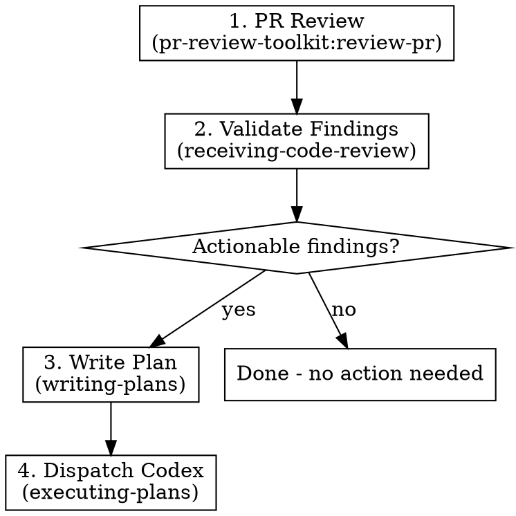

# Review and Execute

## Overview

Orchestrates a full review-to-fix cycle: PR review → validate findings → write remediation plan → dispatch Codex to execute.

**Announce at start:** "I'm using the review-and-execute skill to review and remediate changes."

## Arguments

| Argument | Default | Description |
|----------|---------|-------------|
| `[base-branch]` | `dev` | Branch to diff against |

Usage: `/review-and-execute` or `/review-and-execute main`

## Workflow



### Step 1: PR Review

Invoke the PR review skill against the base branch:

```
Skill("pr-review-toolkit:review-pr", args: "<base-branch>")
```

- Default base branch: `dev`
- If user passed an argument, use that as base branch instead

Wait for the full review to complete. Capture all findings.

### Step 2: Validate Findings

Invoke the receiving-code-review skill:

```
Skill("superpowers:receiving-code-review")
```

This filters the review findings with technical rigor:
- Reject suggestions that are incorrect or unnecessary
- Verify each finding against the actual code before accepting
- Do NOT blindly implement all suggestions

After validation, you have a list of **confirmed actionable findings**.

If there are NO actionable findings after validation, announce this to the user and stop. Do not proceed to steps 3-4.

### Step 3: Write Remediation Plan

Invoke the writing-plans skill with the validated findings as input:

```
Skill("superpowers:writing-plans")
```

**Plan location:** write to `docs/.superpowers/plans/review-plan.md`.

**Never overwrite an existing plan.** If `docs/.superpowers/plans/review-plan.md` already exists, write a new file with a `-vN` suffix where N is the next available integer:

- `review-plan.md` exists → write `review-plan-v2.md`
- `review-plan-v2.md` also exists → write `review-plan-v3.md`
- ...continue until you find a name that does not exist.

Check with `ls docs/.superpowers/plans/review-plan*.md` before deciding the filename. Create the `plans/` directory if it does not exist.

The plan should:
- Reference specific findings from the review
- Include file paths and line numbers
- Have bite-sized, executable steps
- Include verification commands for each task

### Step 4: Dispatch Codex

Run Codex CLI non-interactively to execute the plan written in Step 3 (use the exact filename, including any `-vN` suffix):

```bash
codex exec --sandbox workspace-write '$claude-plan-executor docs/.superpowers/plans/<plan-filename>.md'
```

Announce to the user that Codex has been dispatched and provide the command being run.

## Common Mistakes

| Mistake | Fix |
|---------|-----|
| Implementing all review findings blindly | Step 2 exists to filter — use it |
| Skipping the plan and going straight to Codex | Codex needs a structured plan to execute well |
| Writing plan without file paths/line numbers | Codex can't find the code without specifics |
| Forgetting to check if findings are actionable | Stop early if nothing needs fixing |
| Fixing findings directly instead of writing a plan | NEVER fix code yourself — always write a plan (step 3) and dispatch Codex (step 4). No exceptions, even for trivial fixes. |
| Shortcutting steps because the fix seems small | Every step must be followed in order. The process is the point. |
| Overwriting an existing review-plan.md | Always bump to `-v2`, `-v3`, etc. Plans are immutable history. |
