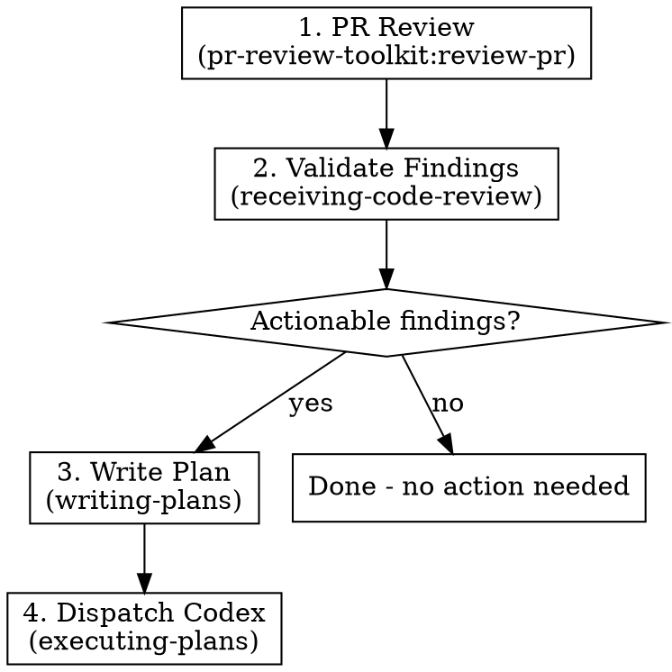

# Review and Execute

## Overview

Orchestrates a full review-to-fix cycle: PR review → validate findings → write remediation plan → dispatch Codex to execute.

**Announce at start:** "I'm using the review-and-execute skill to review and remediate changes."

## Strict Execution Protocol (non-negotiable)

<!-- juel:protocol v4 -->

**1. Preflight, then task list, before anything else.** Before any other output and before any tool call, emit the Preflight block (below). If the preflight verdict is STOP, print the preflight block and **stop** — do not create tasks and do not begin work. Otherwise, before any other work, create one task per phase in this skill's `## Phases` list via `TaskCreate` — `subject` is the phase name, `activeForm` is its present-continuous form. This task list, rendered persistently by the harness, IS the checklist; nothing else satisfies this rule. This is not optional on re-invocation, on resume, or when the user says "just do it".

**2. Phases run in order.** No skipping, reordering, or merging. A phase that does not apply is still announced, not dropped: mark its task `completed` via `TaskUpdate`, with the one-line evidence required by rule 3 stating the skip reason (e.g. "SKIPPED: <reason>") — the task list has no separate "skipped" status, so a skipped phase becomes `completed` too. Never begin phase N+1 before phase N's task is marked `completed`.

**3. Report after every phase.** Mark the phase's task `in_progress` via `TaskUpdate` when starting it, then `completed` via `TaskUpdate` when it finishes or is skipped — each transition accompanied by exactly one line of evidence (path written, command run, count found). Do not re-print the checklist as text; the task list is the persistent record and replaces that. Never claim progress in prose alone.

**4. `review-pr`'s agents run in PARALLEL and FOREGROUND; `code-simplifier` runs FOREGROUND; `codex exec` runs BACKGROUND, WATCHED, and WAITED-ON.** This overrides every other instruction in this file and in any skill invoked from it. Foreground/background is about whether the tool call blocks; watched is about whether output still streams somewhere the user can see it — these are different axes, and `codex exec` needs the second without the first. `review-pr`'s agents additionally need PARALLEL: dispatched together, not one at a time.
- `pr-review-toolkit:review-pr`'s agents MUST be dispatched in parallel: pass `all parallel`, or dispatch the agents together in ONE message. Its sequential default — one agent at a time — is the exact slowness this rule exists to prevent; requesting it, or omitting `all parallel`, is a violation.
- `pr-review-toolkit:review-pr` and `code-simplifier` are foreground-only. Invoke both with `run_in_background: false` **explicitly** — the harness backgrounds subagents by default, so omitting the flag is a violation, not a neutral choice. Dispatching review-pr's agents in parallel does not relax this: each agent in that one message still carries its own explicit `run_in_background: false`. Never `&`. Never `run_in_background: true` for these two. Never "dispatch and continue".
- `codex exec` runs through the **Bash tool**, whose `timeout` parameter is capped at 600000ms (10 minutes). A real `codex exec` applying a plan routinely runs longer than that, so a foreground dispatch gets silently DETACHED by the harness at the cap regardless of this rule — nothing then watches it, nothing reads its output, and the skill would wrongly proceed as if the phase had ended. `review-pr` and `code-simplifier` run through the **Skill/Agent tool**, which carries no such cap — that is the entire reason only `codex exec` changes. Do not "fix" this back to foreground; the cap is a harness fact, not a preference.
- **Always dispatch `codex exec` with `run_in_background: true`** — not optional, not "if it looks long," always. Omitting the flag, or passing `false`, is a violation.
- **Never redirect a command's output to a log file.** No `> out.log`, no `| tee`, no writing output somewhere to read back later. This applies to all three, and is now MORE load-bearing for `codex exec`: backgrounded with no ceiling, the shell is the only place the user watches it work.
- For `review-pr` and `code-simplifier`: read the complete output and state the outcome — finding count, exit status, files changed — before marking the phase done. A summary may follow the raw output; it may never replace it.
- For `codex exec`: wait for it to exit before marking the phase done — backgrounding must never become fire-and-forget. Then state the outcome — exit status, files changed — not a transcript; the user already watched it stream in the shell, so its full output is never printed back into the conversation.
- **Never attach a `Monitor` or a polling loop to `codex exec`.** No `Monitor` armed on its output, no repeated reads of the `.output` file, no `tail -f`. Dispatch it backgrounded and wait for the completion notification — the user already watches it stream in their own shell, which is exactly why output must never be redirected; a watcher on top adds nothing, and a filter with no pattern for `Reading additional input from stdin...` will misread a stalled executor as healthy.
- Passing any of this into another session (a CMUX prompt, a nested `claude`) carries these rules with it — say so explicitly in that prompt string.

**5. Confirmation gates stack; they do not replace this.** Where this skill pauses between phases, the checklist report comes first, then the "Proceed to phase N+1?" question. A user's "yes" advances exactly one phase — it never authorizes skipping ahead or batching the remainder.

## Preflight

| Dep | Type | H/S | Check | If missing |
|---|---|---|---|---|
| pr-review-toolkit | skill | SOFT | ships as a plugin dependency | fall back to `/review`, or an inline review of `git diff <base>...HEAD` |
| superpowers | skill | HARD | ships as a plugin dependency | STOP → `/plugin install superpowers@claude-plugins-official` |
| codex | cli | SOFT | `command -v codex` | execute the plan in-session via superpowers:executing-plans |
| git repo with a diffable base | context | HARD | `git rev-parse --show-toplevel` | STOP |

## Phases

This list is the source for `TaskCreate`: one task per phase, `subject` is the phase name, `activeForm` is its present-continuous form, all created before any other work.

1. PR review — pr-review-toolkit:review-pr against the base branch, FOREGROUND, output read in full
2. Validate findings via superpowers:receiving-code-review
3. Write the remediation plan, or stop here if there are zero actionable findings
4. Run the executor on that plan, BACKGROUND (watched, waited-on)
5. Report the plan path, the command run, and the result

## Arguments

| Argument | Default | Description |
|----------|---------|-------------|
| `[base-branch]` | auto-detected — see "Base branch detection" in Step 1 | Branch to diff against |

Usage: `/review-and-execute` or `/review-and-execute main`

## Workflow



### Step 1: PR Review

Invoke the PR review skill. `review-pr` determines its own scope from the changed files — its
`argument-hint` takes a review aspect (`comments`, `tests`, `errors`, `types`, `code`, `simplify`,
`all`), not a branch name, so no base branch is passed here:

```
Skill("pr-review-toolkit:review-pr", args: "all parallel", run_in_background: false)
```

> Require `all parallel` mode so the review agents dispatch together instead of one at a time. Read the entire review output and state the finding count before proceeding to phase 2.

**Base branch detection.** If the caller passed an explicit argument, use it. Otherwise, in order:
`config.baseBranch` → `git config --get claude.baseBranch` →
`git symbolic-ref --short refs/remotes/<remote>/HEAD` (if missing, `git remote set-head <remote>
--auto` and retry once) → `gh repo view --json defaultBranchRef -q .defaultBranchRef.name` → first
existing of main, master, develop, dev, trunk → ask once and offer to persist.

**Caveat:** default and *integration* branch differ in gitflow repos. If a `develop`/`dev` branch
exists on the remote AND ≥70% of the last 30 merges into it came from `feat/*`-shaped branches,
prefer it and say so. Config always wins. Resolve this once and reuse it for the rest of this run.

You **must** wait for the full review and read every finding before phase 2.

### Step 2: Validate Findings

Invoke the receiving-code-review skill:

```
Skill("superpowers:receiving-code-review")
```

This filters the review findings with technical rigor:
- Reject suggestions that are incorrect or unnecessary
- Verify each finding against the actual code before accepting
- Do NOT blindly implement all suggestions

After validation, you have a list of **confirmed actionable findings**.

If there are NO actionable findings after validation, announce this to the user and stop. Do not proceed to steps 3-4.

### Step 3: Write Remediation Plan

**Resolve `docsRoot` once, then reuse it.** In order:
1. `config.docsRoot`, if set.
2. `<repo-root>/docs/.superpowers/` **if it exists and is non-empty** — an existing repo keeps
   using the dotted path so prior specs, plans and context are never stranded or split.
3. Otherwise `<repo-root>/docs/superpowers/` — canonical for every new repo.

Never pick between the two variants ad hoc. Layout underneath is
`${docsRoot}/{specs,plans,context,findings}/`.

```bash
ROOT=$(git rev-parse --show-toplevel)
# Step 1 of the precedence above (config.docsRoot in .claude/workflow.json /
# .claude/workflow.local.json) — if set there, use that value directly
# instead of the filesystem check below. Steps 2-3 (filesystem fallback):
if [ -d "$ROOT/docs/.superpowers" ] && [ -n "$(ls -A "$ROOT/docs/.superpowers" 2>/dev/null)" ]; then
  docsRoot="$ROOT/docs/.superpowers"
else
  docsRoot="$ROOT/docs/superpowers"
fi
```

(If `.claude/workflow.json` or `.claude/workflow.local.json` sets `docsRoot`, that value wins over
the filesystem check above — config always takes precedence.)

Ensure the repo's `.gitignore` contains unanchored `superpowers/` and `.superpowers/` entries —
unanchored so they match at any depth. Add them if absent. This directory is scratch, not product.

**Never overwrite an existing file under `${docsRoot}`.** On a name collision — a spec, plan,
findings report, or context file that already exists at the derived path — append `-v2` before
the extension; if `-v2` exists too, use `-v3`, and so on. This applies to every file type written
under `${docsRoot}`, not only the one this skill produces.

Invoke the writing-plans skill with the validated findings as input:

```
Skill("superpowers:writing-plans")
```

**Plan location:** write to `${docsRoot}/plans/review-plan.md`.

**Never overwrite an existing plan.** If `${docsRoot}/plans/review-plan.md` already exists, write a new file with a `-vN` suffix where N is the next available integer:

- `review-plan.md` exists → write `review-plan-v2.md`
- `review-plan-v2.md` also exists → write `review-plan-v3.md`
- ...continue until you find a name that does not exist.

Check with `ls "${docsRoot}/plans"/review-plan*.md` before deciding the filename. Create the `plans/` directory if it does not exist.

The plan should:
- Reference specific findings from the review
- Include file paths and line numbers
- Have bite-sized, executable steps
- Include verification commands for each task

### Step 4: Dispatch Codex

Run Codex CLI non-interactively to execute the plan written in Step 3 (use the exact filename, including any `-vN` suffix):

The harness pipes stdin and never closes it, so codex waits for an EOF that never arrives, and without `< /dev/null` here it hangs silently with the prompt unprocessed.

```bash
codex exec --sandbox workspace-write '$claude-plan-executor ${docsRoot}/plans/<plan-filename>.md' < /dev/null
```

Always run this in the **background** (`run_in_background: true`) — `codex exec` runs through the Bash tool, whose 600s timeout cap would otherwise silently detach it mid-run. Do not redirect its output to a file — the user watches the executor run in the shell. Announce to the user that Codex has been dispatched and provide the command being run.

Wait for it to exit, then state the exit status and files changed before marking the phase done — do not print its full output back into the conversation.

## Common Mistakes

| Mistake | Fix |
|---------|-----|
| Implementing all review findings blindly | Step 2 exists to filter — use it |
| Skipping the plan and going straight to Codex | Codex needs a structured plan to execute well |
| Writing plan without file paths/line numbers | Codex can't find the code without specifics |
| Forgetting to check if findings are actionable | Stop early if nothing needs fixing |
| Fixing findings directly instead of writing a plan | NEVER fix code yourself — always write a plan (step 3) and dispatch Codex (step 4). No exceptions, even for trivial fixes. |
| Shortcutting steps because the fix seems small | Every step must be followed in order. The process is the point. |
| Overwriting an existing review-plan.md | Always bump to `-v2`, `-v3`, etc. Plans are immutable history. |
