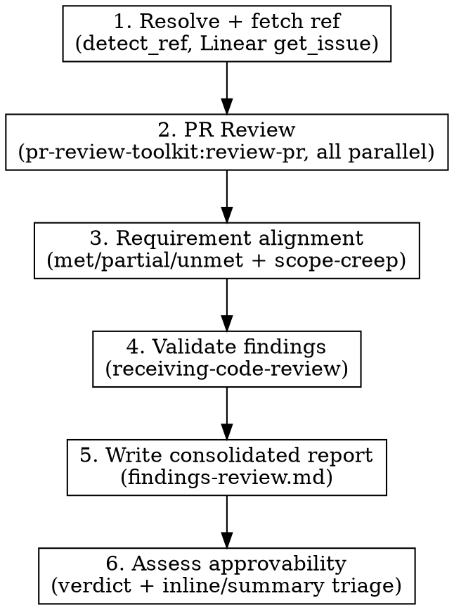

# Review PR

## Overview

Reviews the current diff in this repo — a fresh, self-contained review cycle: resolve and fetch the linked work item (if any) → run `pr-review-toolkit:review-pr` → assess requirement alignment → validate every finding → write a consolidated report → assess approvability and triage findings into inline vs. summary-comment candidates. Everything the review needs lives in this skill, not in a prompt string handed to another session.

Differs from `/juel:cmux-review-pr`: that skill spins up an isolated worktree and CMUX workspace and queues this skill as the startup prompt inside it. This skill does the actual reviewing, wherever it runs.

**Announce:** "Using juel:review-pr to review the current diff."

## Strict Execution Protocol (non-negotiable)

<!-- juel:protocol v4 -->

**1. Preflight, then task list, before anything else.** Before any other output and before any tool call, emit the Preflight block (below). If the preflight verdict is STOP, print the preflight block and **stop** — do not create tasks and do not begin work. Otherwise, before any other work, create one task per phase in this skill's `## Phases` list via `TaskCreate` — `subject` is the phase name, `activeForm` is its present-continuous form. This task list, rendered persistently by the harness, IS the checklist; nothing else satisfies this rule. This is not optional on re-invocation, on resume, or when the user says "just do it".

**2. Phases run in order.** No skipping, reordering, or merging. A phase that does not apply is still announced, not dropped: mark its task `completed` via `TaskUpdate`, with the one-line evidence required by rule 3 stating the skip reason (e.g. "SKIPPED: <reason>") — the task list has no separate "skipped" status, so a skipped phase becomes `completed` too. Never begin phase N+1 before phase N's task is marked `completed`.

**3. Report after every phase.** Mark the phase's task `in_progress` via `TaskUpdate` when starting it, then `completed` via `TaskUpdate` when it finishes or is skipped — each transition accompanied by exactly one line of evidence (path written, command run, count found). Do not re-print the checklist as text; the task list is the persistent record and replaces that. Never claim progress in prose alone.

**4. `review-pr`'s agents run in PARALLEL and FOREGROUND; `code-simplifier` runs FOREGROUND; `codex exec` runs BACKGROUND, WATCHED, and WAITED-ON.** This overrides every other instruction in this file and in any skill invoked from it. Foreground/background is about whether the tool call blocks; watched is about whether output still streams somewhere the user can see it — these are different axes, and `codex exec` needs the second without the first. `review-pr`'s agents additionally need PARALLEL: dispatched together, not one at a time.
- `pr-review-toolkit:review-pr`'s agents MUST be dispatched in parallel: pass `all parallel`, or dispatch the agents together in ONE message. Its sequential default — one agent at a time — is the exact slowness this rule exists to prevent; requesting it, or omitting `all parallel`, is a violation.
- `pr-review-toolkit:review-pr` and `code-simplifier` are foreground-only. Invoke both with `run_in_background: false` **explicitly** — the harness backgrounds subagents by default, so omitting the flag is a violation, not a neutral choice. Dispatching review-pr's agents in parallel does not relax this: each agent in that one message still carries its own explicit `run_in_background: false`. Never `&`. Never `run_in_background: true` for these two. Never "dispatch and continue".
- `codex exec` runs through the **Bash tool**, whose `timeout` parameter is capped at 600000ms (10 minutes). A real `codex exec` applying a plan routinely runs longer than that, so a foreground dispatch gets silently DETACHED by the harness at the cap regardless of this rule — nothing then watches it, nothing reads its output, and the skill would wrongly proceed as if the phase had ended. `review-pr` and `code-simplifier` run through the **Skill/Agent tool**, which carries no such cap — that is the entire reason only `codex exec` changes. Do not "fix" this back to foreground; the cap is a harness fact, not a preference.
- **Always dispatch `codex exec` with `run_in_background: true`** — not optional, not "if it looks long," always. Omitting the flag, or passing `false`, is a violation.
- **Never redirect a command's output to a log file.** No `> out.log`, no `| tee`, no writing output somewhere to read back later. This applies to all three, and is now MORE load-bearing for `codex exec`: backgrounded with no ceiling, the shell is the only place the user watches it work.
- For `review-pr` and `code-simplifier`: read the complete output and state the outcome — finding count, exit status, files changed — before marking the phase done. A summary may follow the raw output; it may never replace it.
- For `codex exec`: wait for it to exit before marking the phase done — backgrounding must never become fire-and-forget. Then state the outcome — exit status, files changed — not a transcript; the user already watched it stream in the shell, so its full output is never printed back into the conversation.
- **Never attach a `Monitor` or a polling loop to `codex exec`.** No `Monitor` armed on its output, no repeated reads of the `.output` file, no `tail -f`. Dispatch it backgrounded and wait for the completion notification — the user already watches it stream in their own shell, which is exactly why output must never be redirected; a watcher on top adds nothing, and a filter with no pattern for `Reading additional input from stdin...` will misread a stalled executor as healthy.
- Passing any of this into another session (a CMUX prompt, a nested `claude`) carries these rules with it — say so explicitly in that prompt string.

**5. Confirmation gates stack; they do not replace this.** Where this skill pauses between phases, the checklist report comes first, then the "Proceed to phase N+1?" question. A user's "yes" advances exactly one phase — it never authorizes skipping ahead or batching the remainder.

## Preflight

| Dep | Type | H/S | Check | If missing |
|---|---|---|---|---|
| pr-review-toolkit | skill | SOFT | ships as a plugin dependency | fall back to `/review`, or an inline review of `git diff <base>...HEAD` |
| superpowers | skill | HARD | ships as a plugin dependency | STOP → `/plugin install superpowers@claude-plugins-official` |
| Linear MCP | mcp | SOFT | **none — render as `?`** | review proceeds ungraded; the Requirement-alignment section is omitted |
| gh | cli | SOFT | `command -v gh` | ref resolution relies on the branch name alone; review proceeds ungraded if that alone yields nothing |
| git repo | context | HARD | `git rev-parse --show-toplevel` | STOP |

## Phases

This list is the source for `TaskCreate`: one task per phase, `subject` is the phase name, `activeForm` is its present-continuous form, all created before any other work.

1. Resolve the work-item ref and fetch it, or record that there is none and skip grading
2. Run pr-review-toolkit:review-pr, all parallel, FOREGROUND, read the complete output
3. Assess requirement alignment against the fetched work item
4. Validate every finding via superpowers:receiving-code-review
5. Write the consolidated report
6. Assess approval readiness and triage findings for posting

## Arguments

| Argument | Default | Description |
|----------|---------|-------------|
| `[ref]` | auto-detected — see Step 1 | Work-item reference (e.g. `SAVI-1234` or `#42`) to grade the review against |

Usage: `/juel:review-pr` or `/juel:review-pr SAVI-1234`

## Workflow



### Step 1: Resolve and fetch the work-item ref

If `[ref]` was supplied as an argument, use it directly — skip detection entirely. Otherwise resolve
it via `detect_ref` — anchored to whole `/`-delimited segments with a denylist of generic
branch-type words (never a loose substring match), the same shared helper `juel:start` and
`juel:cmux-review-pr` inline. Try the current branch name first, then the current branch's open PR
title:

```bash
branch=$(git rev-parse --abbrev-ref HEAD 2>/dev/null)
title=$(gh pr view --json title --jq='.title' 2>/dev/null)

DENY='^(feat|fix|chore|refactor|docs|test|hotfix|release|wip|perf|build|ci|style|v|part|step|pr|review|backup|bugfix|day|demo|draft|new|old|phase|poc|revert|spike|sprint|sync|task|temp|tmp|update|week)$'

_ref_from_segment() {
  seg=$1
  case "$seg" in
    *-*) : ;;
    *) return 1 ;;
  esac
  prefix=${seg%%-*}
  rest=${seg#*-}
  case "$rest" in
    *-*) num=${rest%%-*} ;;
    *)   num=$rest ;;
  esac
  lc_prefix=$(printf '%s' "$prefix" | tr 'A-Z' 'a-z')
  case "$lc_prefix" in
    issue|issues)
      case "$num" in
        ''|*[!0-9]*) return 1 ;;
      esac
      printf '#%s\n' "$num"
      return 0
      ;;
  esac
  case "$prefix" in
    *[!A-Za-z]*) return 1 ;;
  esac
  [ "${#prefix}" -ge 2 ] || return 1
  case "$num" in
    ''|*[!0-9]*) return 1 ;;
  esac
  if printf '%s\n' "$lc_prefix" | grep -Eq "$DENY"; then
    return 1
  fi
  uc_prefix=$(printf '%s' "$prefix" | tr 'a-z' 'A-Z')
  printf '%s-%s\n' "$uc_prefix" "$num"
  return 0
}

detect_ref() {
  str=$1; pat=${2:-}
  result=$(printf '%s\n' "$str" | tr '/' '\n' | while IFS= read -r seg; do
    if ref=$(_ref_from_segment "$seg") && [ -n "$ref" ]; then
      if [ -n "$pat" ]; then
        printf '%s\n' "$ref" | grep -Eq "$pat" || continue
      fi
      printf '%s\n' "$ref"
      break
    fi
  done)
  [ -n "$result" ] && { printf '%s\n' "$result"; return 0; }
  return 1
}

REF=$(detect_ref "$branch") || {
  # PR titles aren't pre-segmented by '/' the way branch names are, and free-form prose must
  # NEVER be fed to detect_ref's segment matcher wholesale: DENY enumerates branch-type words
  # (feat, chore, release, ...), not general technical vocabulary, so converting every space to
  # a '/' delimiter would let ordinary titles leak phantom refs — "Fix UTF-8 handling" -> UTF-8,
  # "Upgrade to Node-18" -> NODE-18, "Add OAuth-2 support" -> OAUTH-2. Instead, extract ONLY the
  # tag span from a leading "[...]" or "type(...)" conventional-commit scope (e.g.
  # "[SAVI-1343] Fix login redirect bug" -> "SAVI-1343"; "feat(SAVI-1343): fix login" ->
  # "SAVI-1343") and run detect_ref on that span alone — text outside the tag is never
  # segmented at all. detect_ref's own algorithm and DENY list (above) are untouched by this
  # narrowing; the normalization lives entirely outside the shared function.
  tag=$(printf '%s' "$title" | sed -n 's/^\[\([^]]*\)\].*/\1/p')
  [ -n "$tag" ] || tag=$(printf '%s' "$title" | sed -n 's/^[A-Za-z]*(\([^)]*\)).*/\1/p')
  if [ -n "$tag" ]; then
    title_norm=$(printf '%s' "$tag" | tr ':' '/')
    REF=$(detect_ref "$title_norm") || REF=""
  else
    REF=""
  fi
}
```

If `REF` is non-empty, fetch it via the Linear MCP `get_issue` for `$REF` and read its requirements
and acceptance criteria — treat them as the spec this diff must satisfy. If `REF` is empty, or the
fetch fails, or the item is not found, skip work-item grading entirely and note that in the report.
**Never block the review on a missing or unfetchable ref** — proceed straight to Step 2 either way.

### Step 2: Run pr-review-toolkit:review-pr

```
Skill("pr-review-toolkit:review-pr", args: "all parallel", run_in_background: false)
```

Require `all parallel` mode so the review agents dispatch together instead of one at a time. Read
the entire review output and state the finding count before proceeding to Step 3. Capture every
finding — file, line, severity, claim, suggested fix — nothing summarized away yet.

### Step 3: Assess requirement alignment

If a work item was fetched in Step 1, go through each requirement and acceptance criterion
individually and mark it **met** / **partial** / **unmet**, citing the diff evidence that supports
the verdict. Separately, flag anything the diff does that the work item never asked for as
**scope-creep**.

If no work item was fetched (no ref resolved, the fetch failed, or the item was not found), skip
this step's grading — note "no work item — ungraded" for the report — and proceed straight to
Step 4 with the code-quality findings from Step 2.

### Step 4: Validate findings

Invoke the receiving-code-review skill:

```
Skill("superpowers:receiving-code-review")
```

This filters every finding from Step 2 with technical rigor:
- Reject suggestions that are incorrect or unnecessary
- Verify each finding against the actual code before accepting
- Do NOT blindly implement all suggestions

Sort every finding from Step 2 into exactly one of three buckets — **Confirmed**, **Rejected**, or
**Ambiguous** (defined in Step 5). A finding whose validation outcome is unclear is Ambiguous, not
dropped. No finding may go unaccounted for.

### Step 5: Write the consolidated report

**Resolve `docsRoot` once, then reuse it.** In order:
1. `config.docsRoot`, if set.
2. `<repo-root>/docs/.superpowers/` **if it exists and is non-empty** — an existing repo keeps
   using the dotted path so prior specs, plans and context are never stranded or split.
3. Otherwise `<repo-root>/docs/superpowers/` — canonical for every new repo.

Never pick between the two variants ad hoc. Layout underneath is
`${docsRoot}/{specs,plans,context,findings}/`.

```bash
ROOT=$(git rev-parse --show-toplevel)
# Step 1 of the precedence above (config.docsRoot in .claude/workflow.json /
# .claude/workflow.local.json) — if set there, use that value directly
# instead of the filesystem check below. Steps 2-3 (filesystem fallback):
if [ -d "$ROOT/docs/.superpowers" ] && [ -n "$(ls -A "$ROOT/docs/.superpowers" 2>/dev/null)" ]; then
  docsRoot="$ROOT/docs/.superpowers"
else
  docsRoot="$ROOT/docs/superpowers"
fi
```

(If `.claude/workflow.json` or `.claude/workflow.local.json` sets `docsRoot`, that value wins over
the filesystem check above — config always takes precedence.)

Ensure the repo's `.gitignore` contains unanchored `superpowers/` and `.superpowers/` entries —
unanchored so they match at any depth. Add them if absent. This directory is scratch, not product.

**Never overwrite an existing file under `${docsRoot}`.** On a name collision — a spec, plan,
findings report, or context file that already exists at the derived path — append `-v2` before
the extension; if `-v2` exists too, use `-v3`, and so on. This applies to every file type written
under `${docsRoot}`, not only the one this skill produces.

Write the report to `${docsRoot}/findings/findings-review.md` with exactly four sections, in this
order (Step 6 appends a fifth once triage runs):

1. **Requirement-alignment** — each requirement/acceptance criterion from Step 3, marked met /
   partial / unmet with evidence, plus any scope-creep beyond the work item. Omit this section
   entirely (with a one-line note explaining why — no ref, fetch failed, or not found) when there
   is no work item.
2. **Confirmed** — findings from Step 4 that survived validation and are actionable.
3. **Rejected** — findings validation found incorrect or unnecessary, each **with the reason**.
4. **Ambiguous** — findings that could not be settled against the diff and need the user's
   judgment.

**Every finding captured in Step 2 must appear in exactly one of Confirmed / Rejected / Ambiguous —
state this explicitly in the report.** Silently dropping a finding between Step 2 and the report is
this plugin's most recurrent defect class; a reader of the report must be able to verify the count
in equals the count out.

### Step 6: Assess approval readiness and triage postable findings

Using the Requirement-alignment, Confirmed, and Ambiguous sections written in Step 5, decide a
**verdict** and split the postable content into an **inline** list and a **summary body**. This
step never touches GitHub — it only produces the draft that Step 7 later posts, or that stays in
the report for manual posting.

**Verdict** — apply these rules in order, stop at the first match:

1. Any Requirement-alignment item is **unmet** → `REQUEST_CHANGES`.
2. Any Confirmed finding is a correctness or security defect (not a style/simplification nit) →
   `REQUEST_CHANGES`.
3. Any Ambiguous finding remains, or any Requirement-alignment item is **partial** → `COMMENT`.
4. Otherwise → `APPROVE`.

State the one-line rule that produced the verdict (e.g. "REQUEST_CHANGES: Confirmed finding at
`src/auth.py:42` is a correctness defect").

**Inline vs. summary triage** — for every Confirmed finding:

- **Inline** when it has a concrete `file` and `line`, and that line falls within the PR's diff
  (a line that changed, or sits inside a diff hunk). GitHub's review API rejects comments anchored
  outside the diff, so a finding that cannot be placed this way is never queued as inline — route
  it to the summary instead.
- **Summary** when it lacks a precise `file`/`line` anchor, references a line outside the diff, or
  is a cross-cutting/architectural observation that reads better as prose than as a line comment.

Every Ambiguous finding goes into the summary as an open question for the human to resolve — never
posted inline, since it is by definition unresolved. Note the count of Rejected findings in one
summary line (not their detail) so nothing is silently dropped from the record, without spamming
the PR with dismissed nitpicks.

Append a fifth section to the **same** `findings-review.md` written in Step 5 — do not create a
second file:

```markdown
## Verdict & posting plan

**Verdict:** APPROVE | REQUEST_CHANGES | COMMENT — <the one-line rule that produced it>

**Summary body** (goes into the GitHub review's `body` field):

<markdown text: verdict rationale, requirement-alignment recap if graded, non-inline Confirmed
findings, Ambiguous findings as open questions, one-line Rejected-count footer>

**Inline comments** (goes into the GitHub review's `comments[]` field):

| File | Line | Body |
|---|---|---|
| path/to/file.py | 42 | <finding claim + suggested fix> |
```

If there are zero inline-worthy findings, the table has a header and no rows — never omit the
table itself. If Confirmed is empty and no work item was graded, or every requirement is met with
no blocking findings, the verdict is `APPROVE` with an empty inline table.

## Edge cases

| Situation | Action |
|-----------|--------|
| `[ref]` argument supplied | Use it directly; skip Step 1's `detect_ref` entirely |
| No ref in branch name or PR title | Review proceeds ungraded; Requirement-alignment section omitted with a one-line note. Do not block. |
| PR title has a ref with no surrounding `[...]`/`type(...)` tag (e.g. bare `SAVI-1343 Fix login`, no brackets) | Known limitation: the title fallback only extracts from a bracket or conventional-commit-scope span, deliberately, to avoid segmenting free-form prose. Falls through to "no ref" unless the branch name already carried it — branch is tried first and usually does. |
| `gh` not installed or no PR open for the current branch | Title fallback is skipped; ref resolution relies on the branch name alone |
| Ref resolved but Linear `get_issue` fails / not found | Proceed with code review only; Requirement-alignment section records the fetch failure instead of grading |
| `pr-review-toolkit` not installed | Fall back to `/review`, or an inline review of `git diff <base>...HEAD` |
| Zero findings from Step 2 | Confirmed / Rejected / Ambiguous sections are all empty; still write the report and say so explicitly — do not skip the report |
| All findings rejected | Still write the report with an empty Confirmed section; do not suppress the file |
| `${docsRoot}/findings/` does not exist yet | Create it (`mkdir -p`) before writing the report |
| Existing `findings-review.md` from a prior run | Never overwrite it. Write `findings-review-v2.md` instead; if that exists too, `-v3`, and so on — same versioning rule as every other file under `${docsRoot}` |
| Confirmed finding has no `file`/`line`, or references a line outside the PR's diff | Goes to the summary body, never the inline table — GitHub rejects inline comments anchored outside the diff |
| No Confirmed or Ambiguous findings, and all graded requirements are met (or ungraded) | Verdict is `APPROVE` with an empty inline table |
| Zero inline-worthy findings but a non-empty summary | Still post — `comments: []` with a populated `body` is valid |
