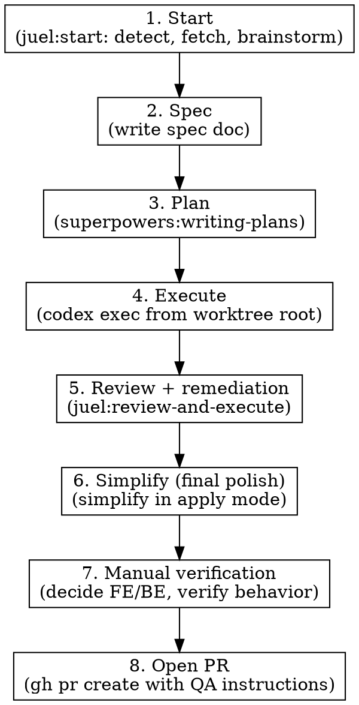

# Ship Ticket

## Overview

End-to-end orchestration that replaces the manual sequence `/juel:start` → `/juel:execute` → `/juel:review-and-execute` with a single skill. Simplify runs **last**, as the final polish after review remediation, so it cleans up whatever shape the code ends up in rather than producing findings that get rewritten by the review pass.

**Announce at start:** "I'm using juel:ship-ticket to drive SAVI-XXX from ticket to PR."

## Strict Execution Protocol (non-negotiable)

<!-- juel:protocol v1 -->

**1. Preflight, then checklist, before anything else.** Before any other output and before any tool call, emit the Preflight block (below), then this skill's `## Phases` checklist rendered as:

```
<skill-name> — N phases
[ ] 1. <phase name>
[ ] 2. <phase name>
```

If the preflight verdict is STOP, print the preflight block and **stop** — do not print the checklist and do not begin work. Otherwise no work begins until the checklist is on screen. This is not optional on re-invocation, on resume, or when the user says "just do it".

**2. Phases run in order.** No skipping, reordering, or merging. A phase that does not apply is still announced: mark it `[-] N. <name> — SKIPPED: <one-line reason>` and continue at N+1. Never drop a phase silently. Never begin phase N+1 before phase N is marked done or skipped.

**3. Report after every phase.** Re-emit the checklist (`[x]` done, `[-]` skipped, `[ ]` pending) plus one line of evidence for the phase just finished — path written, command run, count found. Never claim progress in prose alone.

**4. Everything runs in the FOREGROUND.** This overrides every other instruction in this file and in any skill invoked from it.
- `pr-review-toolkit:review-pr`, `simplify`, and `codex exec` are all foreground-only. Invoke subagents with `run_in_background: false` **explicitly** — the harness backgrounds subagents by default, so omitting the flag is a violation, not a neutral choice.
- Never `&`. Never `run_in_background: true`. Never "dispatch and continue".
- **Never redirect a command's output to a log file.** No `> out.log`, no `| tee`, no writing output somewhere to read back later. The user must be able to watch the run as it happens.
- Do not request `review-pr`'s parallel / `all parallel` mode.
- Read the complete output and state the outcome — finding count, exit status, files changed — before marking the phase done. A summary may follow the raw output; it may never replace it.
- Passing any of this into another session (a CMUX prompt, a nested `claude`) carries these rules with it — say so explicitly in that prompt string.

**5. Confirmation gates stack; they do not replace this.** Where this skill pauses between phases, the checklist report comes first, then the "Proceed to phase N+1?" question. A user's "yes" advances exactly one phase — it never authorizes skipping ahead or batching the remainder.

## Preflight

| Dep | Type | H/S | Check | If missing |
|---|---|---|---|---|
| git worktree, cwd = root | context | HARD | `test "$PWD" = "$(git rev-parse --show-toplevel)"` | STOP → run from the worktree root |
| clean working tree | context | HARD | `git status --porcelain` empty | STOP → commit or stash first |
| superpowers | skill | HARD | ships as a plugin dependency | STOP |
| juel:start, juel:review-and-execute | skill | HARD | ship with this plugin | STOP |
| pr-review-toolkit | skill | SOFT | ships as a plugin dependency | phase 5 falls back to `/review` |
| simplify | skill | SOFT | built-in | phase 6 SKIPPED with a note |
| run | skill | SOFT | built-in | phase 7 drives `commands.run` directly and observes |
| juel:regression | skill | SOFT | ships with this plugin | phase 7 frontend path is manual |
| codex | cli | SOFT | `command -v codex` | phase 4 executes the plan in-session |
| gh | cli | SOFT | `command -v gh` | phase 8 prints a compare URL instead of opening the PR |
| Linear MCP | mcp | HARD | **none — render as `?`** | proceed; phase 1 fetch and phase 8 status write fail loudly |

## Phases

[ ] 1. Start — juel:start: detect, fetch, brainstorm
[ ] 2. Spec — write the spec doc
[ ] 3. Plan — superpowers:writing-plans
[ ] 4. Execute — run the executor from the worktree root, FOREGROUND
[ ] 5. Review + remediation — juel:review-and-execute
[ ] 6. Simplify (final polish) — simplify in apply mode, FOREGROUND
[ ] 7. Manual verification — decide FE/BE, verify real behavior
[ ] 8. Open PR — with QA instructions, update the work-item status

Note phase 6's preflight row is SOFT while its phase is not optional: if `simplify` is genuinely unavailable the phase is marked `[-] SKIPPED`, which protocol rule 2 requires be announced rather than dropped.

## Arguments

| Argument | Default | Description |
|----------|---------|-------------|
| `[ticket-id]` | auto-detect from worktree | Linear ticket id, e.g. `SAVI-1162` |
| `[base-branch]` | auto-detected — see "Base branch & repo conventions" below | Branch to diff/PR against |

Usage: `/juel:ship-ticket` or `/juel:ship-ticket SAVI-1162`

## Base branch & repo conventions

Resolved **once**, before Phase 5, then reused for the rest of the run (Phase 8's push, PR title,
PR body, and trailers all read the same resolved values — never re-derive mid-run).

**Base branch**, in order: explicit argument → `config.baseBranch` →
`git config --get claude.baseBranch` → `git symbolic-ref --short refs/remotes/<remote>/HEAD`
(if missing, `git remote set-head <remote> --auto` and retry once) →
`gh repo view --json defaultBranchRef -q .defaultBranchRef.name` →
first existing of main, master, develop, dev, trunk → ask once and offer to persist.

**Caveat:** default and *integration* branch differ in gitflow repos. If a `develop`/`dev`
branch exists on the remote AND ≥70% of the last 30 merges into it came from `feat/*`-shaped
branches, prefer it and say so. Config always wins.

**Remote:** exactly one → use it; contains `origin` → use `origin`; else ask once and cache.

**Branch naming:** sample `git for-each-ref --sort=-committerdate --count=60 refs/remotes/<remote>`,
strip the remote prefix and default branch, classify each into `type-slash` /
`type-slash-noticket` / `ticket-first` / `user-slash` / `flat`, take the mode. Default
`{type}/{ref-lower}-{slug}` when there is no history.

**Commit style:** sample `git log --no-merges -n 60 --format=%s`. ≥60% conventional →
`conventional`; of those, ≥50% with a ticket-shaped scope → `conventional-ticket`; else
`freeform` — mirror the tone of the last 20 subjects, do not impose a format.

**Trailers:** `git log -n 100 --format=%B | grep -ci '^Co-Authored-By:'` — zero means omit.
Default when ambiguous is omit.

**PR body**, in order: `.github/PULL_REQUEST_TEMPLATE.md` →
`.github/pull_request_template.md` → `.github/PULL_REQUEST_TEMPLATE/*.md` →
`docs/PULL_REQUEST_TEMPLATE.md` → `PULL_REQUEST_TEMPLATE.md`.

Found: **fill** the template's sections; do not add or reorder them.
None: use the default body — Summary / Requirement source / QA instructions / Test plan.

Write via `gh pr create --body-file <tmp>`, never a HEREDOC.

**PR title:** sample `gh pr list --state merged --limit 30 --json title`. ≥50% starting with a
bracketed ref → `[REF] <title>`; ≥50% conventional → `feat(REF): <title>`; else plain title.
When there is no ref, drop the prefix entirely.

None of the above ever aborts the skill: an inconclusive detection asks once (and offers to persist
the answer to `.claude/workflow.json`) or falls through to its documented default — never guessed
silently, never a convention the repo doesn't exhibit.

## Toolchain commands

This skill runs against whatever repo it's invoked in — never assume `black`, `npm test`, or any
other single toolchain. Resolve each of `commands.install`, `.test`, `.lint`, `.typecheck`,
`.format`, `.run` **independently** — a repo may legitimately get `test` from a Makefile and
`typecheck` from `package.json`. Probed in tiers, stopping at the first verified hit per key:

- **Tier A — project-authored task runners** (highest priority; the author chose the entry point):
  `Makefile`, `justfile`, `Taskfile.yml`, `mise.toml`. Emit `make <target>` (or `just`/`task`/`mise
  run <target>`) only for targets that actually exist in the file — e.g. `make install`/`make test`
  only when those targets are defined, never assumed.
- **Tier B — language manifests.** Same rule as Tier A: a manifest proposes a command for a key
  **only if that key's own evidence is actually present** — `install` is the sole exception (it's a
  package-manager primitive that needs no script/config to exist). This gate runs **before** the
  head-binary check below; a command that fails it is never proposed at all, and Tier B falls
  through to Tier C (or `null`) for that key exactly as if nothing had matched.

  | Manifest (+ lockfile) | Tool | `install` | `test` | `lint` | `typecheck` | `format` | `run` |
  |---|---|---|---|---|---|---|---|
  | `package.json` + `package-lock.json` | npm | `npm install` | `npm test` — **only if `scripts.test` exists** | `npm run lint` — **only if `scripts.lint` exists** | `npm run typecheck` — **only if `scripts.typecheck` exists** | `npm run format` — **only if `scripts.format` exists** | `npm start` — **only if `scripts.start` exists**, else `npm run dev` if `scripts.dev` exists |
  | `package.json` + `yarn.lock` | yarn | `yarn install` | `yarn test` — same `scripts.test` gate | `yarn lint` — same `scripts.lint` gate | `yarn typecheck` — same `scripts.typecheck` gate | `yarn format` — same `scripts.format` gate | `yarn start` / `yarn dev` — same gate as npm |
  | `package.json` + `pnpm-lock.yaml` | pnpm | `pnpm install` | `pnpm test` — same gate | `pnpm run lint` — same gate | `pnpm run typecheck` — same gate | `pnpm run format` — same gate | `pnpm start` / `pnpm run dev` — same gate |
  | `package.json` + `bun.lockb` | bun | `bun install` | `bun test` — **only if `scripts.test` exists OR a `*.test.*`/`*.spec.*` file exists** (bun ships its own runner) | `bun run lint` — same `scripts.lint` gate | `bun run typecheck` — same gate | `bun run format` — same gate | `bun start` / `bun run dev` — same gate |
  | `pyproject.toml` + `uv.lock` | uv | `uv sync` | `uv run pytest` — **only if `pytest` is a listed dependency or a `tests/`/`test/` dir exists** | `uv run ruff check` — **only if a `[tool.ruff]` section exists**, else if `flake8`/`pylint` is a listed dependency | `uv run mypy .` — **only if a `[tool.mypy]` section exists or `mypy` is a listed dependency** | `uv run ruff format --check` — **only if `[tool.ruff]` exists**, else `uv run black --check .` if `black` is listed | `uv run <entry>` — **only if `[project.scripts]` defines an entry** |
  | `pyproject.toml` + `poetry.lock` | poetry | `poetry install` | `poetry run pytest` — same gate as uv | `poetry run ruff check` — same gate as uv | `poetry run mypy .` — same gate as uv | `poetry run ruff format --check` / `poetry run black --check .` — same gate as uv | `poetry run <entry>` — same gate as uv |
  | `Cargo.toml` | cargo | `cargo fetch` | `cargo test` — a crate always defines this target, so no extra gate | `cargo clippy` — **only if the `clippy` component resolves** (`cargo clippy --version` succeeds) | `cargo check` | `cargo fmt --check` — **only if the `rustfmt` component resolves** | `cargo run` — **only if a `[[bin]]` target or `src/main.rs` exists** |
  | `go.mod` | go | `go mod download` | `go test ./...` | `golangci-lint run` — **only if `golangci-lint` resolves on PATH**, else `go vet ./...` | `go vet ./...` | `gofmt -l .` | `go run .` — **only if a `main` package exists** |
  | `mix.exs` | mix | `mix deps.get` | `mix test` | `mix credo` — **only if `credo` is a listed dep** | `mix dialyzer` — **only if `dialyxir` is a listed dep** | `mix format --check-formatted` | `mix run` — **only if the project defines a runnable entry** |
  | `Gemfile` | bundler | `bundle install` | `bundle exec rspec` — **only if `rspec` is a listed dep**, else `bundle exec rake test` if a `Rakefile` defines a `test` task | `bundle exec rubocop` — **only if `rubocop` is a listed dep** | `null` (no standard opt-out-free Ruby typechecker) | `bundle exec rubocop -a --dry-run` — **only if `rubocop` is a listed dep** | `null` unless a framework entry (`bin/rails`, `config.ru`) is present |
  | Gradle (`build.gradle`/`.kts`) | gradle | `./gradlew build -x test` | `./gradlew test` | `./gradlew check` — **only if a lint/checkstyle plugin is configured** | `null` unless a typecheck-capable plugin is configured | `./gradlew spotlessCheck` — **only if the Spotless plugin is configured** | `./gradlew run` — **only if the `application` plugin is configured** |
  | Maven (`pom.xml`) | maven | `mvn install -DskipTests` | `mvn test` | `mvn checkstyle:check` — **only if the checkstyle plugin is configured** | `null` unless a typecheck-capable plugin is configured | `mvn spotless:check` — **only if the Spotless plugin is configured** | `mvn spring-boot:run` — **only if the Spring Boot plugin is configured** |
  | `composer.json` | composer | `composer install` | `composer test` — **only if `scripts.test` exists**, else `vendor/bin/phpunit` if `phpunit/phpunit` is a listed dep | `vendor/bin/phpcs` — **only if `squizlabs/php_codesniffer` is a listed dep** | `vendor/bin/phpstan` — **only if `phpstan/phpstan` is a listed dep** | `vendor/bin/php-cs-fixer fix --dry-run` — **only if `friendsofphp/php-cs-fixer` is a listed dep** | `null` unless `scripts.start` or a framework entry exists |
  | dotnet (`*.csproj`) | dotnet | `dotnet restore` | `dotnet test` | `null` unless an analyzer is configured | `dotnet build` (a failing compile *is* the typecheck signal) | `dotnet format --verify-no-changes` | `dotnet run` |

- **Tier C — CI, as a last resort:** extract `run:` steps from `.github/workflows/*.yml`. Treat as a
  **suggestion** and confirm with the user — never run a CI-derived command blind.

In a monorepo declaring workspaces, resolve per-package and record the package dir alongside each
command.

**Verify before accepting — never accept a command whose entry point cannot run.** This runs after
Tier B's existence gate above, never in place of it — the head binary resolving is necessary but not
sufficient; `npm install`+`npm` on `PATH` says nothing about whether `scripts.test` exists.

```sh
head_bin=$(printf '%s' "$cmd" | awk '{print $1}')
case "$head_bin" in
  ./*) [ -x "$head_bin" ] || reject ;;
  *)   command -v "$head_bin" >/dev/null 2>&1 || reject ;;
esac
```

For `make`/`just`/`task`, additionally confirm the target exists. On reject, fall through to the
next tier. **Resolution is side-effect free — never run the command itself while resolving.**

**A missing command is not an error.** If nothing in any tier resolves and verifies for a given key,
that key resolves to `null` and the corresponding gate is **skipped with an explicit one-line note**
("no test command resolved — test gate skipped"), never invented (never `npm test` for a repo with
no `test` script), and never a reason to stop the skill.

**Resolve once, in Phase 4; reuse in Phases 5, 6 and 7 — never re-detect per phase.** This whole
tiered probe runs exactly one time per run, in Phase 4, immediately after Codex finishes. Its result
(one line per key: resolved command + source tier, or `null — skipped`) is reported as part of Phase
4's checkpoint. Phases 5, 6 and 7 read that already-reported set as-is; they must not re-run tier
detection, re-scan for `Makefile`/`package.json`, or otherwise "pick project-relevant lint/test
commands" fresh at each phase — that ad-hoc re-picking is the same failure mode Task 15 fixed for
`docsRoot` (a value that drifts mid-run because two phases derived it independently instead of one
phase resolving it and the rest reusing that answer).

## Phase gating

**Pause for explicit user confirmation between every phase.** Never chain phases automatically. After each phase, summarize what was done and ask: "Proceed to phase N+1: <name>?"

## Workflow



### Phase 1 — Start

Invoke `Skill("juel:start")`. It detects the ticket id from the worktree (`basename $(pwd)`), fetches the Linear issue, summarizes requirements, and runs `superpowers:brainstorming`.

If the user passed an explicit ticket id as argument, use that instead of the worktree-detected one.

**Checkpoint:** confirm the chosen approach before writing the spec.

### Phase 2 — Spec

**Resolve `docsRoot` once, then reuse it.** In order:
1. `config.docsRoot`, if set.
2. `<repo-root>/docs/.superpowers/` **if it exists and is non-empty** — an existing repo keeps
   using the dotted path so prior specs, plans and context are never stranded or split.
3. Otherwise `<repo-root>/docs/superpowers/` — canonical for every new repo.

Never pick between the two variants ad hoc. Layout underneath is
`${docsRoot}/{specs,plans,context,findings}/`.

```bash
ROOT=$(git rev-parse --show-toplevel)
# Step 1 of the precedence above (config.docsRoot in .claude/workflow.json /
# .claude/workflow.local.json) — if set there, use that value directly
# instead of the filesystem check below. Steps 2-3 (filesystem fallback):
if [ -d "$ROOT/docs/.superpowers" ] && [ -n "$(ls -A "$ROOT/docs/.superpowers" 2>/dev/null)" ]; then
  docsRoot="$ROOT/docs/.superpowers"
else
  docsRoot="$ROOT/docs/superpowers"
fi
```

(If `.claude/workflow.json` or `.claude/workflow.local.json` sets `docsRoot`, that value wins over
the filesystem check above — config always takes precedence.)

Ensure the repo's `.gitignore` contains unanchored `superpowers/` and `.superpowers/` entries —
unanchored so they match at any depth. Add them if absent. This directory is scratch, not product.

Write a short spec doc capturing the agreed approach from brainstorming.

- Path: `${docsRoot}/specs/<YYYY-MM-DD>-savi-XXX-<slug>.md` (gitignored, per user memory)
- Contents: problem, chosen approach, scope (in/out), risks, acceptance criteria pulled from the Linear ticket.

**Checkpoint:** show spec path, ask to proceed.

### Phase 3 — Plan

Invoke `Skill("superpowers:writing-plans")` using the spec as input.

- Plan path: `${docsRoot}/plans/<YYYY-MM-DD>-savi-XXX-<slug>.md` (docsRoot already resolved in phase 2 — reuse it, do not re-derive)
- Each step must include file paths, line refs where applicable, and a verification command.

**Checkpoint:** show plan path, ask to proceed.

### Phase 4 — Execute

Verify cwd is the worktree root (not `frontend/` or any subdirectory) — Codex sandbox requires this. If not at root, `cd` to it.

Dispatch Codex non-interactively, run this in the **foreground** (`run_in_background: false`):

```bash
codex exec --sandbox workspace-write '$claude-plan-executor ${docsRoot}/plans/<plan-file>.md'
```

Do not redirect its output to a file — the user watches the executor run. Wait for it to exit, read the complete output, and state the exit status and files changed before marking the phase done.

**Resolve toolchain commands now, once.** Immediately after Codex finishes, resolve
`commands.install`, `.test`, `.lint`, `.typecheck`, `.format` and `.run` per "Toolchain commands"
above. This step is side-effect-free detection only — it must not install or run anything. Report
the resolved set in this phase's checkpoint (one line per key: command + source tier, or `null —
skipped`). Phases 5, 6 and 7 reuse this exact set; see "Toolchain commands" for why re-resolving
mid-run is a Common Mistake, not a harmless redundancy.

**Checkpoint:** Codex finished. Summarize files changed (`git status`, `git diff --stat`) and the
resolved toolchain commands (key → command or `null — skipped`, with source tier). Ask to proceed.

### Phase 5 — Review + remediation

**Resolve base branch, remote, branch naming, commit style and trailers now** (per "Base branch &
repo conventions" above), before delegating — the rest of this run (including Phase 8) reuses these
resolved values rather than re-deriving them.

Delegate the full review-validate-plan-execute cycle to `/juel:review-and-execute`:

```
Skill("juel:review-and-execute", args: "<resolved-base-branch>")
```

That skill internally runs:
1. `pr-review-toolkit:review-pr` against the base branch
2. `superpowers:receiving-code-review` to filter findings with technical rigor
3. `superpowers:writing-plans` → writes to `${docsRoot}/plans/review-plan.md` (auto-bumps to `-v2`, `-v3`, ... if a prior one exists)
4. `codex exec --sandbox workspace-write` to apply remediation

If the inner skill announces zero actionable findings, remediation is skipped automatically. Continue to phase 6 (simplify still runs) and phase 7 (verification still runs) either way.

After it returns, run the `test` and `lint` commands resolved in Phase 4 (reused here — do not re-derive) to verify nothing regressed. Run a command only when its resolved value is non-null; a `null` command reports its one-line skip note (e.g. "no lint command resolved — lint gate skipped") and the phase continues rather than stopping.

**Checkpoint:** show diff summary post-remediation. Ask to proceed.

### Phase 6 — Simplify (final polish)

This is the last **planned** code-change phase (phase 7 verification may still loop back if it finds a defect). Run after review remediation so simplify operates on the final shape of the code, not a draft that's about to be rewritten.

1. Invoke `Skill("simplify", run_in_background: false)` in normal apply mode — let it edit files directly. The skill itself targets recently-modified code, which is what we want.
2. Read simplify's complete output and state what it changed before marking phase 6 done.
3. After simplify finishes, re-run the `format`, `lint` and `test` commands resolved in Phase 4 (the same resolved set Phase 5 used — reused again, not re-derived) to verify the polish did not regress anything. Any command that resolved to `null` in Phase 4 has its gate skipped here too, with the same one-line note.
4. Review the simplify diff. If anything looks wrong, revert that specific change with `git restore -p` rather than the whole pass.

**Checkpoint:** show diff summary post-simplify. Ask to proceed to manual verification.

### Phase 7 — Manual verification

Verify the change actually works before opening the PR. This phase is **human-in-the-loop**: do not open the PR on the strength of passing unit tests alone.

1. **Ask the user, explicitly:** "How do we test these changes manually? Do you need anything from me (test account, env var, seed data, a specific org/case, a running service)?" Wait for their answer — they may already know the exact steps.
2. **Decide who drives, based on what changed (`git diff --stat`):**
   - **Frontend / UI** — the user usually verifies in the browser themselves. Offer concrete steps (route, inputs, expected result) derived from the work item's acceptance criteria, and let them confirm. If they want automated help, or are unavailable, invoke `Skill("juel:regression", run_in_background: false)` to drive the change through Playwright and capture evidence.
   - **Backend / API** — Claude drives. Invoke `Skill("run", run_in_background: false)` to launch the app and observe real behavior (hit the endpoint, check the DB, exercise the background task). If `run` is unavailable, execute the `commands.run` resolved in Phase 4 directly (reuse it, do not re-derive) and observe. Ask the user only for inputs you cannot self-serve.
   - **Mixed** — split: Claude verifies the BE surface, the user confirms the FE surface.
3. **Run the actual verification**, capturing evidence (request/response, log lines, screenshots, DB rows). Map each acceptance-criterion to an observed result.
4. If verification surfaces a defect, **do not patch by hand** — loop back to Phase 5 (`/juel:review-and-execute`) or adjust the plan and re-run Phase 4. Re-verify after the fix.

**Checkpoint:** summarize what was verified, who verified it, and the evidence. Ask to proceed to PR.

### Phase 8 — Open PR

1. Push the branch: `git push -u <resolved-remote> <branch>` (remote resolved in Phase 5 — reuse it, do not re-derive).
2. Resolve the PR title and body per "Base branch & repo conventions" above:
   - **Title:** apply the detected `[REF] <title>` / `feat(REF): <title>` / plain-title convention; drop the ref segment entirely if none was resolved.
   - **Body:** if a PR template was found, fill its sections (Linear link, QA instructions and test plan slot into whatever sections the template provides) without adding or reordering sections. If none was found, use the default body: **Summary** (1-3 bullets of what changed and why) / **Requirement source** (link to the Linear ticket) / **QA instructions** (concrete steps a reviewer can follow, derived from the ticket's acceptance criteria) / **Test plan** (checklist).
   - Write the body to a temp file and create the PR with `gh pr create --title "<title>" --body-file <tmp>` — **never** a HEREDOC.
3. Update the Linear ticket status to "In Review" via `mcp__linear__save_issue`.
4. Return the PR URL to the user.

Trailers: apply the detected convention from "Base branch & repo conventions" above (zero `Co-Authored-By:` history → omit; do not impose a trailer the repo's own commit history doesn't use).

## Failure modes & recovery

| Situation | Action |
|-----------|--------|
| Codex fails in phase 4 | Stop. Show error. Ask user to adjust plan or escalate. Do not run phase 5+. |
| Working tree dirty before phase 4 | Stop. Ask user to commit/stash. |
| Zero actionable findings in phase 5 | `/juel:review-and-execute` handles this internally; still run phase 6 (simplify), phase 7 (verification), and phase 8 (PR). |
| Lint/tests fail after phase 5 | Loop back: invoke `/juel:review-and-execute` again — it will write a `-vN` plan and dispatch Codex. Do not hand-edit. |
| Simplify introduces a regression in phase 6 | `git restore -p` the offending hunks; do not revert the whole pass blindly. |
| Verification finds a defect in phase 7 | Do not hand-patch. Loop back to phase 5 (`/juel:review-and-execute`) or phase 4 (adjust plan, re-run Codex), then re-verify. Do not open the PR until verification passes. |
| User unavailable to verify a FE change in phase 7 | Offer the `regression` skill (Playwright MCP) to verify in their place, or note in the PR body which AC remain manually unverified so the reviewer covers them. |
| Not in a worktree | Ask user; do not auto-create one. |

## Common mistakes

| Mistake | Fix |
|---------|-----|
| Skipping checkpoints to "save time" | Every phase pauses. The point is reviewable handoffs. |
| Re-resolving install/test/lint/typecheck/format/run commands at each phase | Resolve once in Phase 4 (see "Toolchain commands"); Phases 5, 6 and 7 reuse that exact reported set, never re-scan the repo. |
| Running simplify before review remediation | Simplify is the last planned code-change phase (phase 6) so it polishes the final shape of the code, not a draft. |
| Hand-editing instead of delegating remediation | Never. Phase 5 delegates to `/juel:review-and-execute`; do not bypass it. |
| Dispatching Codex from `frontend/` or another subdir | Always cd to worktree root first. |
| Skipping `git status` review between phases | Each checkpoint must show what changed. |
| Opening the PR on green unit tests alone | Phase 7 requires observed behavior, not just passing tests. Verify the real surface first. |
| Posting PR review-style summary instead of QA-oriented body | Phase 8 PR body is for the reviewer, not a changelog. |
| Forgetting to update Linear status | Phase 8 step 3. |

## Notes

- Spec/plan/findings files live under `${docsRoot}/` (gitignored) per user memory.
- Branch naming, commit style, and trailers follow the detected convention (see "Base branch & repo conventions" above) — never a hardcoded assumption.
- For dependent tickets: branch from the parent tip, do not rebase (user memory).
