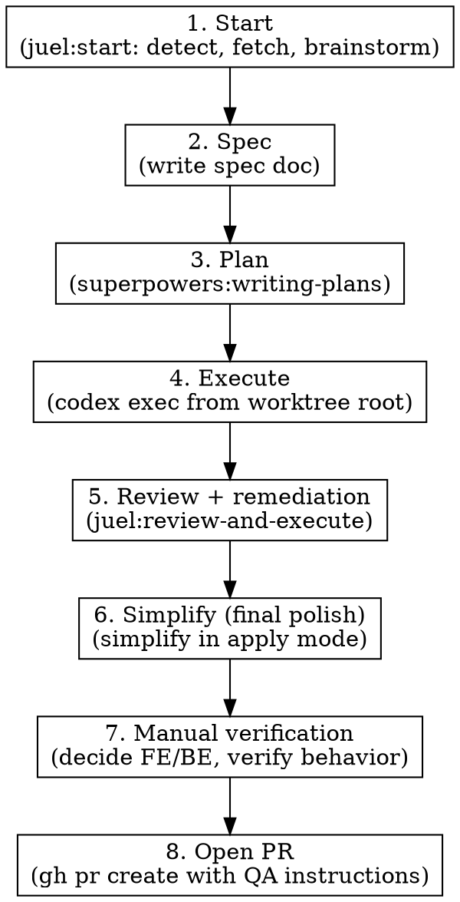

# Ship Ticket

## Overview

End-to-end orchestration that replaces the manual sequence `/juel:start` → `/juel:execute` → `/juel:review-and-execute` with a single skill. Simplify runs **last**, as the final polish after review remediation, so it cleans up whatever shape the code ends up in rather than producing findings that get rewritten by the review pass.

**Announce at start:** "I'm using juel:ship-ticket to drive SAVI-XXX from ticket to PR."

## Strict Execution Protocol (non-negotiable)

<!-- juel:protocol v1 -->

**1. Preflight, then checklist, before anything else.** Before any other output and before any tool call, emit the Preflight block (below), then this skill's `## Phases` checklist rendered as:

```
<skill-name> — N phases
[ ] 1. <phase name>
[ ] 2. <phase name>
```

If the preflight verdict is STOP, print the preflight block and **stop** — do not print the checklist and do not begin work. Otherwise no work begins until the checklist is on screen. This is not optional on re-invocation, on resume, or when the user says "just do it".

**2. Phases run in order.** No skipping, reordering, or merging. A phase that does not apply is still announced: mark it `[-] N. <name> — SKIPPED: <one-line reason>` and continue at N+1. Never drop a phase silently. Never begin phase N+1 before phase N is marked done or skipped.

**3. Report after every phase.** Re-emit the checklist (`[x]` done, `[-]` skipped, `[ ]` pending) plus one line of evidence for the phase just finished — path written, command run, count found. Never claim progress in prose alone.

**4. Everything runs in the FOREGROUND.** This overrides every other instruction in this file and in any skill invoked from it.
- `pr-review-toolkit:review-pr`, `simplify`, and `codex exec` are all foreground-only. Invoke subagents with `run_in_background: false` **explicitly** — the harness backgrounds subagents by default, so omitting the flag is a violation, not a neutral choice.
- Never `&`. Never `run_in_background: true`. Never "dispatch and continue".
- **Never redirect a command's output to a log file.** No `> out.log`, no `| tee`, no writing output somewhere to read back later. The user must be able to watch the run as it happens.
- Do not request `review-pr`'s parallel / `all parallel` mode.
- Read the complete output and state the outcome — finding count, exit status, files changed — before marking the phase done. A summary may follow the raw output; it may never replace it.
- Passing any of this into another session (a CMUX prompt, a nested `claude`) carries these rules with it — say so explicitly in that prompt string.

**5. Confirmation gates stack; they do not replace this.** Where this skill pauses between phases, the checklist report comes first, then the "Proceed to phase N+1?" question. A user's "yes" advances exactly one phase — it never authorizes skipping ahead or batching the remainder.

## Preflight

| Dep | Type | H/S | Check | If missing |
|---|---|---|---|---|
| git worktree, cwd = root | context | HARD | `test "$PWD" = "$(git rev-parse --show-toplevel)"` | STOP → run from the worktree root |
| clean working tree | context | HARD | `git status --porcelain` empty | STOP → commit or stash first |
| superpowers | skill | HARD | ships as a plugin dependency | STOP |
| juel:start, juel:review-and-execute | skill | HARD | ship with this plugin | STOP |
| pr-review-toolkit | skill | SOFT | ships as a plugin dependency | phase 5 falls back to `/review` |
| simplify | skill | SOFT | built-in | phase 6 SKIPPED with a note |
| run | skill | SOFT | built-in | phase 7 drives `commands.run` directly and observes |
| juel:regression | skill | SOFT | ships with this plugin | phase 7 frontend path is manual |
| codex | cli | SOFT | `command -v codex` | phase 4 executes the plan in-session |
| gh | cli | SOFT | `command -v gh` | phase 8 prints a compare URL instead of opening the PR |
| Linear MCP | mcp | HARD | **none — render as `?`** | proceed; phase 1 fetch and phase 8 status write fail loudly |

## Phases

[ ] 1. Start — juel:start: detect, fetch, brainstorm
[ ] 2. Spec — write the spec doc
[ ] 3. Plan — superpowers:writing-plans
[ ] 4. Execute — run the executor from the worktree root, FOREGROUND
[ ] 5. Review + remediation — juel:review-and-execute
[ ] 6. Simplify (final polish) — simplify in apply mode, FOREGROUND
[ ] 7. Manual verification — decide FE/BE, verify real behavior
[ ] 8. Open PR — with QA instructions, update the work-item status

Note phase 6's preflight row is SOFT while its phase is not optional: if `simplify` is genuinely unavailable the phase is marked `[-] SKIPPED`, which protocol rule 2 requires be announced rather than dropped.

## Arguments

| Argument | Default | Description |
|----------|---------|-------------|
| `[ticket-id]` | auto-detect from worktree | Linear ticket id, e.g. `SAVI-1162` |
| `[base-branch]` | `dev` | Branch to diff/PR against |

Usage: `/juel:ship-ticket` or `/juel:ship-ticket SAVI-1162`

## Phase gating

**Pause for explicit user confirmation between every phase.** Never chain phases automatically. After each phase, summarize what was done and ask: "Proceed to phase N+1: <name>?"

## Workflow



### Phase 1 — Start

Invoke `Skill("juel:start")`. It detects the ticket id from the worktree (`basename $(pwd)`), fetches the Linear issue, summarizes requirements, and runs `superpowers:brainstorming`.

If the user passed an explicit ticket id as argument, use that instead of the worktree-detected one.

**Checkpoint:** confirm the chosen approach before writing the spec.

### Phase 2 — Spec

Write a short spec doc capturing the agreed approach from brainstorming.

- Path: `docs/.superpowers/specs/<YYYY-MM-DD>-savi-XXX-<slug>.md` (gitignored, per user memory)
- Contents: problem, chosen approach, scope (in/out), risks, acceptance criteria pulled from the Linear ticket.

**Checkpoint:** show spec path, ask to proceed.

### Phase 3 — Plan

Invoke `Skill("superpowers:writing-plans")` using the spec as input.

- Plan path: `docs/.superpowers/plans/<YYYY-MM-DD>-savi-XXX-<slug>.md`
- Each step must include file paths, line refs where applicable, and a verification command.

**Checkpoint:** show plan path, ask to proceed.

### Phase 4 — Execute

Verify cwd is the worktree root (not `frontend/` or any subdirectory) — Codex sandbox requires this. If not at root, `cd` to it.

Dispatch Codex non-interactively, run this in the **foreground** (`run_in_background: false`):

```bash
codex exec --sandbox workspace-write '$claude-plan-executor docs/.superpowers/plans/<plan-file>.md'
```

Do not redirect its output to a file — the user watches the executor run. Wait for it to exit, read the complete output, and state the exit status and files changed before marking the phase done.

**Checkpoint:** Codex finished. Summarize files changed (`git status`, `git diff --stat`). Ask to proceed.

### Phase 5 — Review + remediation

Delegate the full review-validate-plan-execute cycle to `/juel:review-and-execute`:

```
Skill("juel:review-and-execute", args: "<base-branch>")
```

That skill internally runs:
1. `pr-review-toolkit:review-pr` against the base branch
2. `superpowers:receiving-code-review` to filter findings with technical rigor
3. `superpowers:writing-plans` → writes to `docs/.superpowers/plans/review-plan.md` (auto-bumps to `-v2`, `-v3`, ... if a prior one exists)
4. `codex exec --sandbox workspace-write` to apply remediation

If the inner skill announces zero actionable findings, remediation is skipped automatically. Continue to phase 6 (simplify still runs) and phase 7 (verification still runs) either way.

After it returns, run `black . --check` and any project-relevant lint/test commands from `CLAUDE.md` to verify nothing regressed.

**Checkpoint:** show diff summary post-remediation. Ask to proceed.

### Phase 6 — Simplify (final polish)

This is the last **planned** code-change phase (phase 7 verification may still loop back if it finds a defect). Run after review remediation so simplify operates on the final shape of the code, not a draft that's about to be rewritten.

1. Invoke `Skill("simplify", run_in_background: false)` in normal apply mode — let it edit files directly. The skill itself targets recently-modified code, which is what we want.
2. Read simplify's complete output and state what it changed before marking phase 6 done.
3. After simplify finishes, re-run `black . --check` and project lint/test commands to verify the polish did not regress anything.
4. Review the simplify diff. If anything looks wrong, revert that specific change with `git restore -p` rather than the whole pass.

**Checkpoint:** show diff summary post-simplify. Ask to proceed to manual verification.

### Phase 7 — Manual verification

Verify the change actually works before opening the PR. This phase is **human-in-the-loop**: do not open the PR on the strength of passing unit tests alone.

1. **Ask the user, explicitly:** "How do we test these changes manually? Do you need anything from me (test account, env var, seed data, a specific org/case, a running service)?" Wait for their answer — they may already know the exact steps.
2. **Decide who drives, based on what changed (`git diff --stat`):**
   - **Frontend / UI** — the user usually verifies in the browser themselves. Offer concrete steps (route, inputs, expected result) derived from the work item's acceptance criteria, and let them confirm. If they want automated help, or are unavailable, invoke `Skill("juel:regression", run_in_background: false)` to drive the change through Playwright and capture evidence.
   - **Backend / API** — Claude drives. Invoke `Skill("run", run_in_background: false)` to launch the app and observe real behavior (hit the endpoint, check the DB, exercise the background task). If `run` is unavailable, execute the resolved `commands.run` directly and observe. Ask the user only for inputs you cannot self-serve.
   - **Mixed** — split: Claude verifies the BE surface, the user confirms the FE surface.
3. **Run the actual verification**, capturing evidence (request/response, log lines, screenshots, DB rows). Map each acceptance-criterion to an observed result.
4. If verification surfaces a defect, **do not patch by hand** — loop back to Phase 5 (`/juel:review-and-execute`) or adjust the plan and re-run Phase 4. Re-verify after the fix.

**Checkpoint:** summarize what was verified, who verified it, and the evidence. Ask to proceed to PR.

### Phase 8 — Open PR

1. Push the branch: `git push -u origin <branch>`
2. Create PR with `gh pr create`:
   - Title: `[SAVI-XXX] <short description>` (from Linear ticket title)
   - Body uses HEREDOC (per CLAUDE.md commit/PR rules) and contains:
     - **Summary** — 1-3 bullets of what changed and why
     - **Linear** — link to ticket
     - **QA instructions** — concrete steps a reviewer can follow to validate, derived from the ticket's acceptance criteria
     - **Test plan** — checklist
3. Update the Linear ticket status to "In Review" via `mcp__linear__save_issue`.
4. Return the PR URL to the user.

**No** Co-Authored-By or AI attribution trailers (per CLAUDE.md).

## Failure modes & recovery

| Situation | Action |
|-----------|--------|
| Codex fails in phase 4 | Stop. Show error. Ask user to adjust plan or escalate. Do not run phase 5+. |
| Working tree dirty before phase 4 | Stop. Ask user to commit/stash. |
| Zero actionable findings in phase 5 | `/juel:review-and-execute` handles this internally; still run phase 6 (simplify), phase 7 (verification), and phase 8 (PR). |
| Lint/tests fail after phase 5 | Loop back: invoke `/juel:review-and-execute` again — it will write a `-vN` plan and dispatch Codex. Do not hand-edit. |
| Simplify introduces a regression in phase 6 | `git restore -p` the offending hunks; do not revert the whole pass blindly. |
| Verification finds a defect in phase 7 | Do not hand-patch. Loop back to phase 5 (`/juel:review-and-execute`) or phase 4 (adjust plan, re-run Codex), then re-verify. Do not open the PR until verification passes. |
| User unavailable to verify a FE change in phase 7 | Offer the `regression` skill (Playwright MCP) to verify in their place, or note in the PR body which AC remain manually unverified so the reviewer covers them. |
| Not in a worktree | Ask user; do not auto-create one. |

## Common mistakes

| Mistake | Fix |
|---------|-----|
| Skipping checkpoints to "save time" | Every phase pauses. The point is reviewable handoffs. |
| Running simplify before review remediation | Simplify is the last planned code-change phase (phase 6) so it polishes the final shape of the code, not a draft. |
| Hand-editing instead of delegating remediation | Never. Phase 5 delegates to `/juel:review-and-execute`; do not bypass it. |
| Dispatching Codex from `frontend/` or another subdir | Always cd to worktree root first. |
| Skipping `git status` review between phases | Each checkpoint must show what changed. |
| Opening the PR on green unit tests alone | Phase 7 requires observed behavior, not just passing tests. Verify the real surface first. |
| Posting PR review-style summary instead of QA-oriented body | Phase 8 PR body is for the reviewer, not a changelog. |
| Forgetting to update Linear status | Phase 8 step 3. |

## Notes

- Spec/plan/findings files live under `docs/.superpowers/` (gitignored) per user memory.
- Branch naming: `feat/savi-xxx-<slug>` or `fix/savi-xxx-<slug>` (CLAUDE.md).
- Commit messages must include the ticket id as scope, e.g. `feat(SAVI-1162): ...` (user memory).
- For dependent tickets: branch from the parent tip, do not rebase (user memory).
