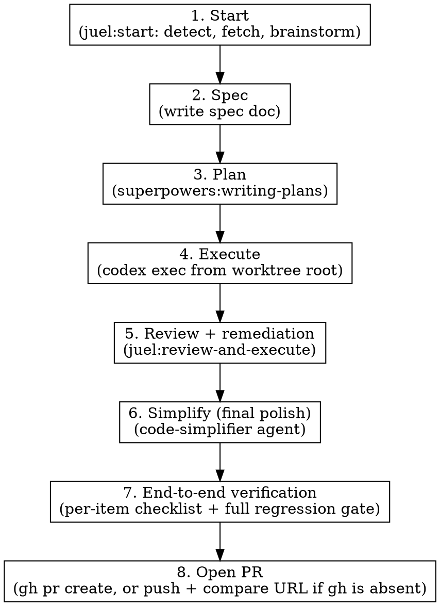

# Ship Ticket

## Overview

End-to-end orchestration that replaces the manual sequence `/juel:start` → `/juel:execute` → `/juel:review-and-execute` with a single skill. The `code-simplifier` agent runs **last**, as the final polish after review remediation, so it cleans up whatever shape the code ends up in rather than producing findings that get rewritten by the review pass.

**Announce at start:** "I'm using juel:ship-ticket to drive the ticket from start to PR."

## Strict Execution Protocol (non-negotiable)

<!-- juel:protocol v6 -->

**1. Preflight, then task list, before anything else.** Before any other output and before any tool call, emit the Preflight block (below). If the preflight verdict is STOP, print the preflight block and **stop** — do not create tasks and do not begin work. Otherwise, before any other work, create one task per phase in this skill's `## Phases` list via `TaskCreate` — `subject` is the phase name, `activeForm` is its present-continuous form. This task list, rendered persistently by the harness, IS the checklist; nothing else satisfies this rule. This is not optional on re-invocation, on resume, or when the user says "just do it".
- **If `TaskCreate`/`TaskUpdate` genuinely fail** — one attempted call returns an error, never merely assumed unavailable in advance — fall back to an explicit numbered phase log, printed after every phase transition with the same one-line evidence rule 3 already requires. State the degradation once, in one line, before continuing. Never silently swap to prose without saying so.

**2. Phases run in order.** No skipping, reordering, or merging. A phase that does not apply is still announced, not dropped: mark its task `completed` via `TaskUpdate`, with the one-line evidence required by rule 3 stating the skip reason (e.g. "SKIPPED: <reason>") — the task list has no separate "skipped" status, so a skipped phase becomes `completed` too. Never begin phase N+1 before phase N's task is marked `completed`.

**3. Report after every phase.** Mark the phase's task `in_progress` via `TaskUpdate` when starting it, then `completed` via `TaskUpdate` when it finishes or is skipped — each transition accompanied by exactly one line of evidence (path written, command run, count found). Do not re-print the checklist as text; the task list is the persistent record and replaces that. Never claim progress in prose alone.

**4. `review-pr`'s agents run in PARALLEL and FOREGROUND; `code-simplifier` runs FOREGROUND; `codex exec` runs BACKGROUND, WATCHED, and WAITED-ON.** This overrides every other instruction in this file and in any skill invoked from it. Foreground/background is about whether the tool call blocks; watched is about whether output still streams somewhere the user can see it — these are different axes, and `codex exec` needs the second without the first. `review-pr`'s agents additionally need PARALLEL: dispatched together, not one at a time.
- `pr-review-toolkit:review-pr`'s agents MUST be dispatched in parallel: pass `all parallel`, or dispatch the agents together in ONE message. Its sequential default — one agent at a time — is the exact slowness this rule exists to prevent; requesting it, or omitting `all parallel`, is a violation.
- `pr-review-toolkit:review-pr` and `code-simplifier` are foreground-only. Invoke both with `run_in_background: false` **explicitly** — the harness backgrounds subagents by default, so omitting the flag is a violation, not a neutral choice. Dispatching review-pr's agents in parallel does not relax this: each agent in that one message still carries its own explicit `run_in_background: false`. Never `&`. Never `run_in_background: true` for these two. Never "dispatch and continue".
- `codex exec` runs through the **Bash tool**, whose `timeout` parameter is capped at 600000ms (10 minutes). A real `codex exec` applying a plan routinely runs longer than that, so a foreground dispatch gets silently DETACHED by the harness at the cap regardless of this rule — nothing then watches it, nothing reads its output, and the skill would wrongly proceed as if the phase had ended. `review-pr` and `code-simplifier` run through the **Skill/Agent tool**, which carries no such cap — that is the entire reason only `codex exec` changes. Do not "fix" this back to foreground; the cap is a harness fact, not a preference.
- **Always dispatch `codex exec` with `run_in_background: true`** — not optional, not "if it looks long," always. Omitting the flag, or passing `false`, is a violation.
- **Never redirect a command's output to a log file.** No `> out.log`, no `| tee`, no writing output somewhere to read back later. This applies to all three, and is now MORE load-bearing for `codex exec`: backgrounded with no ceiling, the shell is the only place the user watches it work.
- For `review-pr` and `code-simplifier`: read the complete output and state the outcome — finding count, exit status, files changed — before marking the phase done. A summary may follow the raw output; it may never replace it.
- For `codex exec`: wait for it to exit before marking the phase done — backgrounding must never become fire-and-forget. Then state the outcome — exit status, files changed — not a transcript; the user already watched it stream in the shell, so its full output is never printed back into the conversation.
- **Never attach a `Monitor` or a polling loop to `codex exec`.** No `Monitor` armed on its output, no repeated reads of the `.output` file, no `tail -f`. Dispatch it backgrounded and wait for the completion notification — the user already watches it stream in their own shell, which is exactly why output must never be redirected; a watcher on top adds nothing, and a filter with no pattern for `Reading additional input from stdin...` will misread a stalled executor as healthy.
- Passing any of this into another session (a CMUX prompt, a nested `claude`) carries these rules with it — say so explicitly in that prompt string.

**5. Confirmation gates stack; they do not replace this.** Where this skill pauses between phases, the checklist report comes first, then the "Proceed to phase N+1?" question. A user's "yes" advances exactly one phase — it never authorizes skipping ahead or batching the remainder.

**6. `Idling` is a status, not a verdict — never read it as "returned nothing."** When a dispatched `pr-review-toolkit:review-pr` agent or `code-simplifier` shows `Idling` (or any non-streaming status) in the harness's agent view while its call is still in flight, that status alone never means the agent produced no output — `Idling` covers both "still working" and "finished, with a result already available but not yet consumed by this session" indistinguishably. Multi-agent dispatch is exactly where this bites: `pr-review-toolkit:review-pr`'s specialist agents run "all parallel" (rule 4), so several can sit at `Idling` simultaneously while one has already returned and the others haven't.
- **Before concluding a dispatch returned nothing, or re-dispatching it, check `ListAgents` for the agent by name.** If it's listed with a result available, read that result directly — do not wait further and do not re-dispatch a duplicate call.
- **Never re-dispatch `pr-review-toolkit:review-pr` or `code-simplifier` "to unstick it"** without first confirming via `ListAgents` that the original dispatch genuinely produced nothing — re-dispatching a call whose result already exists wastes a full review cycle and risks duplicate, conflicting findings.
- **Never go quiet past a check-in point with no status update.** If a dispatch has been running long enough that you would normally report progress, either report genuine progress or check `ListAgents` first — silently waiting while a subagent is actually done is the exact failure this rule exists to prevent.

## Preflight

| Dep | Type | H/S | Check | If missing |
|---|---|---|---|---|
| git worktree, cwd = root | context | HARD | `test "$PWD" = "$(git rev-parse --show-toplevel)"` | STOP → run from the worktree root |
| clean working tree | context | HARD | `git status --porcelain` empty | STOP → commit or stash first |
| superpowers | skill | HARD | ships as a plugin dependency | STOP |
| juel:start, juel:review-and-execute | skill | HARD | ship with this plugin | STOP |
| pr-review-toolkit | skill | SOFT | ships as a plugin dependency | phase 5 falls back to `/review` |
| code-simplifier | skill | SOFT | ships as a plugin dependency | phase 6 SKIPPED with a note |
| run | skill | SOFT | built-in | phase 7 executes the resolved `commands.run` directly and observes |
| verify | skill | SOFT | built-in | phase 7 asks the user to drive the browser themselves and confirm each affected item, recording which items were not verified by Claude directly |
| codex | cli | SOFT | `command -v codex` | phase 4 executes the plan in-session |
| gh | cli | SOFT | `command -v gh` | phase 8 prints a compare URL instead of opening the PR |
| Linear MCP | mcp | SOFT | **none — render as `?`** | phase 1 relies on juel:start's own no-ref/no-list handling; phase 8's status update is skipped with a printed note and never blocks the PR |

## Phases

This list is the source for `TaskCreate`: one task per phase, `subject` is the phase name, `activeForm` is its present-continuous form, all created before any other work.

1. Start — juel:start: detect, fetch, brainstorm
2. Spec — write the spec doc
3. Plan — superpowers:writing-plans
4. Execute — run the executor from the worktree root, BACKGROUND (watched, waited-on)
5. Review + remediation — juel:review-and-execute
6. Simplify (final polish) — code-simplifier agent, FOREGROUND
7. End-to-end verification — exhaustive per-item checklist, Claude drives the real flow, full regression gate before PR
8. Open PR — with QA instructions, update the work-item status

Note phase 6's preflight row is SOFT while its phase is not optional: if `code-simplifier` is genuinely unavailable, that phase's task is still marked `completed` via `TaskUpdate` with a `SKIPPED` evidence line, which protocol rule 2 requires be announced rather than dropped.

## Arguments

| Argument | Default | Description |
|----------|---------|-------------|
| `[ticket-id]` | auto-detect from worktree | Linear ticket id, e.g. `SAVI-1162` |
| `[base-branch]` | auto-detected — see "Base branch & repo conventions" below | Branch to diff/PR against |

Usage: `/juel:ship-ticket` or `/juel:ship-ticket SAVI-1162`

## Base branch & repo conventions

Resolved **once**, before Phase 5, then reused for the rest of the run (Phase 8's push, PR title,
PR body, and trailers all read the same resolved values — never re-derive mid-run).

**Base branch**, in order: explicit argument → `config.baseBranch` →
`git config --get claude.baseBranch` → `git symbolic-ref --short refs/remotes/<remote>/HEAD`
(if missing, `git remote set-head <remote> --auto` and retry once) →
`gh repo view --json defaultBranchRef -q .defaultBranchRef.name` →
first existing of main, master, develop, dev, trunk → ask once and offer to persist.

**Caveat:** default and *integration* branch differ in gitflow repos. If a `develop`/`dev`
branch exists on the remote AND ≥70% of the last 30 merges into it came from `feat/*`-shaped
branches, prefer it and say so. Config always wins.

**Remote:** exactly one → use it; contains `origin` → use `origin`; else ask once and cache.

**Branch naming:** sample `git for-each-ref --sort=-committerdate --count=60 refs/remotes/<remote>`,
strip the remote prefix and default branch, classify each into `type-slash` /
`type-slash-noticket` / `ticket-first` / `user-slash` / `flat`, take the mode. Default
`{type}/{ref-lower}-{slug}` when there is no history.

**Commit style:** sample `git log --no-merges -n 60 --format=%s`. ≥60% conventional →
`conventional`; of those, ≥50% with a ticket-shaped scope → `conventional-ticket`; else
`freeform` — mirror the tone of the last 20 subjects, do not impose a format.

**Trailers:** `git log -n 100 --format=%B | grep -ci '^Co-Authored-By:'` — zero means omit.
Default when ambiguous is omit.

**PR body**, in order: `.github/PULL_REQUEST_TEMPLATE.md` →
`.github/pull_request_template.md` → `.github/PULL_REQUEST_TEMPLATE/*.md` →
`docs/PULL_REQUEST_TEMPLATE.md` → `PULL_REQUEST_TEMPLATE.md`.

Found: **fill** the template's sections; do not add or reorder them.
None: use the default body — Summary / Requirement source / QA instructions / Test plan.

Write via `gh pr create --body-file <tmp>`, never a HEREDOC.

**PR title:** sample `gh pr list --state merged --limit 30 --json title`. ≥50% starting with a
bracketed ref → `[REF] <title>`; ≥50% conventional → `feat(REF): <title>`; else plain title.
When there is no ref, drop the prefix entirely.

None of the above ever aborts the skill: an inconclusive detection asks once (and offers to persist
the answer to `.claude/workflow.json`) or falls through to its documented default — never guessed
silently, never a convention the repo doesn't exhibit.

## Toolchain commands

This skill runs against whatever repo it's invoked in — never assume `black`, `npm test`, or any
other single toolchain. Resolve each of `commands.install`, `.test`, `.lint`, `.typecheck`, `.build`,
`.format`, `.run` **independently** — a repo may legitimately get `test` from a Makefile and
`typecheck` from `package.json`. Probed in tiers, stopping at the first verified hit per key:

- **Tier A — project-authored task runners** (highest priority; the author chose the entry point):
  `Makefile`, `justfile`, `Taskfile.yml`, `mise.toml`. Emit `make <target>` (or `just`/`task`/`mise
  run <target>`) only for targets that actually exist in the file — e.g. `make install`/`make test`
  only when those targets are defined, never assumed.
- **Tier B — language manifests.** Same rule as Tier A: a manifest proposes a command for a key
  **only if that key's own evidence is actually present** — `install` is the sole exception (it's a
  package-manager primitive that needs no script/config to exist). This gate runs **before** the
  head-binary check below; a command that fails it is never proposed at all, and Tier B falls
  through to Tier C (or `null`) for that key exactly as if nothing had matched.

  | Manifest (+ lockfile) | Tool | `install` | `test` | `lint` | `typecheck` | `build` | `format` | `run` |
  |---|---|---|---|---|---|---|---|---|
  | `package.json` + `package-lock.json` | npm | `npm install` | `npm test` — **only if `scripts.test` exists** | `npm run lint` — **only if `scripts.lint` exists** | `npm run typecheck` — **only if `scripts.typecheck` exists** | `npm run build` — **only if `scripts.build` exists** | `npm run format` — **only if `scripts.format` exists** | `npm start` — **only if `scripts.start` exists**, else `npm run dev` if `scripts.dev` exists |
  | `package.json` + `yarn.lock` | yarn | `yarn install` | `yarn test` — same `scripts.test` gate | `yarn lint` — same `scripts.lint` gate | `yarn typecheck` — same `scripts.typecheck` gate | `yarn build` — same `scripts.build` gate | `yarn format` — same `scripts.format` gate | `yarn start` / `yarn dev` — same gate as npm |
  | `package.json` + `pnpm-lock.yaml` | pnpm | `pnpm install` | `pnpm test` — same gate | `pnpm run lint` — same gate | `pnpm run typecheck` — same gate | `pnpm run build` — same gate | `pnpm run format` — same gate | `pnpm start` / `pnpm run dev` — same gate |
  | `package.json` + `bun.lockb` | bun | `bun install` | `bun test` — **only if `scripts.test` exists OR a `*.test.*`/`*.spec.*` file exists** (bun ships its own runner) | `bun run lint` — same `scripts.lint` gate | `bun run typecheck` — same gate | `bun run build` — same `scripts.build` gate | `bun run format` — same gate | `bun start` / `bun run dev` — same gate |
  | `pyproject.toml` + `uv.lock` | uv | `uv sync` | `uv run pytest` — **only if `pytest` is a listed dependency or a `tests/`/`test/` dir exists** | `uv run ruff check` — **only if a `[tool.ruff]` section exists**, else if `flake8`/`pylint` is a listed dependency | `uv run mypy .` — **only if a `[tool.mypy]` section exists or `mypy` is a listed dependency** | `null` — Python applications have no standard build-artifact step; `typecheck`, when resolved, is the compile-equivalent signal | `uv run ruff format --check` — **only if `[tool.ruff]` exists**, else `uv run black --check .` if `black` is listed | `uv run <entry>` — **only if `[project.scripts]` defines an entry** |
  | `pyproject.toml` + `poetry.lock` | poetry | `poetry install` | `poetry run pytest` — same gate as uv | `poetry run ruff check` — same gate as uv | `poetry run mypy .` — same gate as uv | `null` — same reasoning as uv | `poetry run ruff format --check` / `poetry run black --check .` — same gate as uv | `poetry run <entry>` — same gate as uv |
  | `Cargo.toml` | cargo | `cargo fetch` | `cargo test` — a crate always defines this target, so no extra gate | `cargo clippy` — **only if the `clippy` component resolves** (`cargo clippy --version` succeeds) | `cargo check` | `cargo build` — a crate always defines this target, so no extra gate (mirrors `test`) | `cargo fmt --check` — **only if the `rustfmt` component resolves** | `cargo run` — **only if a `[[bin]]` target or `src/main.rs` exists** |
  | `go.mod` | go | `go mod download` | `go test ./...` | `golangci-lint run` — **only if `golangci-lint` resolves on PATH**, else `go vet ./...` | `go vet ./...` | `go build ./...` — always resolves for a Go module, no extra gate | `gofmt -l .` | `go run .` — **only if a `main` package exists** |
  | `mix.exs` | mix | `mix deps.get` | `mix test` | `mix credo` — **only if `credo` is a listed dep** | `mix dialyzer` — **only if `dialyxir` is a listed dep** | `mix compile` — always resolves, no extra gate | `mix format --check-formatted` | `mix run` — **only if the project defines a runnable entry** |
  | `Gemfile` | bundler | `bundle install` | `bundle exec rspec` — **only if `rspec` is a listed dep**, else `bundle exec rake test` if a `Rakefile` defines a `test` task | `bundle exec rubocop` — **only if `rubocop` is a listed dep** | `null` (no standard opt-out-free Ruby typechecker) | `null` — Ruby has no standard build-artifact step | `bundle exec rubocop -a --dry-run` — **only if `rubocop` is a listed dep** | `null` unless a framework entry (`bin/rails`, `config.ru`) is present |
  | Gradle (`build.gradle`/`.kts`) | gradle | `./gradlew build -x test` | `./gradlew test` | `./gradlew check` — **only if a lint/checkstyle plugin is configured** | `null` unless a typecheck-capable plugin is configured | `null` — already covered: the `install` key's `./gradlew build -x test` already performs this build | `./gradlew spotlessCheck` — **only if the Spotless plugin is configured** | `./gradlew run` — **only if the `application` plugin is configured** |
  | Maven (`pom.xml`) | maven | `mvn install -DskipTests` | `mvn test` | `mvn checkstyle:check` — **only if the checkstyle plugin is configured** | `null` unless a typecheck-capable plugin is configured | `null` — already covered: the `install` key's `mvn install -DskipTests` already performs this build | `mvn spotless:check` — **only if the Spotless plugin is configured** | `mvn spring-boot:run` — **only if the Spring Boot plugin is configured** |
  | `composer.json` | composer | `composer install` | `composer test` — **only if `scripts.test` exists**, else `vendor/bin/phpunit` if `phpunit/phpunit` is a listed dep | `vendor/bin/phpcs` — **only if `squizlabs/php_codesniffer` is a listed dep** | `vendor/bin/phpstan` — **only if `phpstan/phpstan` is a listed dep** | `null` — PHP has no standard build-artifact step | `vendor/bin/php-cs-fixer fix --dry-run` — **only if `friendsofphp/php-cs-fixer` is a listed dep** | `null` unless `scripts.start` or a framework entry exists |
  | dotnet (`*.csproj`) | dotnet | `dotnet restore` | `dotnet test` | `null` unless an analyzer is configured | `dotnet build` (a failing compile *is* the typecheck signal) | `null` — already covered: the `typecheck` key's `dotnet build` already performs this build | `dotnet format --verify-no-changes` | `dotnet run` |

- **Tier C — CI, as a last resort:** extract `run:` steps from `.github/workflows/*.yml`. Treat as a
  **suggestion** and confirm with the user — never run a CI-derived command blind.

In a monorepo declaring workspaces, resolve per-package and record the package dir alongside each
command.

**Verify before accepting — never accept a command whose entry point cannot run.** This runs after
Tier B's existence gate above, never in place of it — the head binary resolving is necessary but not
sufficient; `npm install`+`npm` on `PATH` says nothing about whether `scripts.test` exists.

```sh
head_bin=$(printf '%s' "$cmd" | awk '{print $1}')
case "$head_bin" in
  ./*) [ -x "$head_bin" ] || reject ;;
  *)   command -v "$head_bin" >/dev/null 2>&1 || reject ;;
esac
```

For `make`/`just`/`task`, additionally confirm the target exists. On reject, fall through to the
next tier. **Resolution is side-effect free — never run the command itself while resolving.**

**A missing command is not an error.** If nothing in any tier resolves and verifies for a given key,
that key resolves to `null` and the corresponding gate is **skipped with an explicit one-line note**
("no test command resolved — test gate skipped"), never invented (never `npm test` for a repo with
no `test` script), and never a reason to stop the skill.

**Resolve once, in Phase 4; reuse in Phases 5, 6 and 7 — never re-detect per phase.** This whole
tiered probe runs exactly one time per run, in Phase 4, immediately after Codex finishes. Its result
(one line per key: resolved command + source tier, or `null — skipped`) is reported as part of Phase
4's checkpoint. Phases 5, 6 and 7 read that already-reported set as-is; they must not re-run tier
detection, re-scan for `Makefile`/`package.json`, or otherwise "pick project-relevant lint/test
commands" fresh at each phase — that ad-hoc re-picking is the same failure mode Task 15 fixed for
`docsRoot` (a value that drifts mid-run because two phases derived it independently instead of one
phase resolving it and the rest reusing that answer).

## Phase gating

**Pause for explicit user confirmation between every phase.** Never chain phases automatically. After each phase, summarize what was done and ask: "Proceed to phase N+1: <name>?"

## Workflow



### Phase 1 — Start

Invoke `Skill("juel:start")`. It detects the ticket id from the worktree (`basename $(pwd)`), fetches the Linear issue, summarizes requirements, and runs `superpowers:brainstorming`.

If the user passed an explicit ticket id as argument, use that instead of the worktree-detected one.

**Checkpoint:** confirm the chosen approach before writing the spec.

### Phase 2 — Spec

**Resolve `docsRoot` once, then reuse it.** In order:
1. `config.docsRoot`, if set.
2. `<repo-root>/docs/.superpowers/` **if it exists and is non-empty** — an existing repo keeps
   using the dotted path so prior specs, plans and context are never stranded or split.
3. Otherwise `<repo-root>/docs/superpowers/` — canonical for every new repo.

Never pick between the two variants ad hoc. Layout underneath is
`${docsRoot}/{specs,plans,context,findings}/`.

```bash
ROOT=$(git rev-parse --show-toplevel)
# Step 1 of the precedence above (config.docsRoot in .claude/workflow.json /
# .claude/workflow.local.json) — if set there, use that value directly
# instead of the filesystem check below. Steps 2-3 (filesystem fallback):
if [ -d "$ROOT/docs/.superpowers" ] && [ -n "$(ls -A "$ROOT/docs/.superpowers" 2>/dev/null)" ]; then
  docsRoot="$ROOT/docs/.superpowers"
else
  docsRoot="$ROOT/docs/superpowers"
fi
```

(If `.claude/workflow.json` or `.claude/workflow.local.json` sets `docsRoot`, that value wins over
the filesystem check above — config always takes precedence.)

Ensure the repo's `.gitignore` contains unanchored `superpowers/` and `.superpowers/` entries —
unanchored so they match at any depth. Add them if absent. This directory is scratch, not product.

**Never overwrite an existing file under `${docsRoot}`.** On a name collision — a spec, plan,
findings report, or context file that already exists at the derived path — append `-v2` before
the extension; if `-v2` exists too, use `-v3`, and so on. This applies to every file type written
under `${docsRoot}`, not only the one this skill produces.

Write a short spec doc capturing the agreed approach from brainstorming.

- Path: `${docsRoot}/specs/<YYYY-MM-DD>[-<ref-lower>]-<slug>.md` — the ref segment is included, lower-cased, only when the work item has one (e.g. `2026-08-01-savi-1162-add-auth.md`); when `ref` is null it drops out entirely, never a placeholder (e.g. `2026-08-01-add-auth.md`) (gitignored, per user memory)
- **If that path already exists (a re-run for the same ticket on the same day), never overwrite it.** Write `-v2` instead (e.g. `2026-08-01-savi-1162-add-auth-v2.md`); if `-v2` exists too, `-v3`, and so on.
- Contents: problem, chosen approach, scope (in/out), risks, acceptance criteria pulled from the work item if it has any; otherwise ask the user for concrete verification steps and record those in the spec instead.

**Checkpoint:** show spec path, ask to proceed.

### Phase 3 — Plan

Invoke `Skill("superpowers:writing-plans")` using the spec as input.

- Plan path: `${docsRoot}/plans/<YYYY-MM-DD>[-<ref-lower>]-<slug>.md` (same ref-optional naming as the spec path above — omitted entirely when `ref` is null; docsRoot already resolved in phase 2 — reuse it, do not re-derive)
- **If that path already exists, never overwrite it.** Write `-v2` instead; if `-v2` exists too, `-v3`, and so on — same rule as the spec path in Phase 2, and distinct from `review-plan.md`'s own `-vN` versioning in Phase 5 below.
- Each step must include file paths, line refs where applicable, and a verification command.

**Checkpoint:** show plan path, ask to proceed.

### Phase 4 — Execute

Verify cwd is the worktree root (not `frontend/` or any subdirectory) — Codex sandbox requires this. If not at root, `cd` to it.

Dispatch Codex non-interactively. Always run this in the **background** (`run_in_background: true`) — `codex exec` runs through the Bash tool, whose 600s timeout cap would otherwise silently detach it mid-run:

The harness pipes stdin and never closes it, so codex waits for an EOF that never arrives, and without `< /dev/null` here it hangs silently with the prompt unprocessed.

```bash
codex exec --sandbox workspace-write '$claude-plan-executor ${docsRoot}/plans/<plan-file>.md' < /dev/null
```

Do not redirect its output to a file — the user watches the executor run in the shell. Wait for it to exit, then state the exit status and files changed before marking the phase done — do not print its full output back into the conversation.

**Resolve toolchain commands now, once.** Immediately after Codex finishes, resolve
`commands.install`, `.test`, `.lint`, `.typecheck`, `.build`, `.format` and `.run` per "Toolchain
commands" above. This step is side-effect-free detection only — it must not install or run
anything. Report
the resolved set in this phase's checkpoint (one line per key: command + source tier, or `null —
skipped`). Phases 5, 6 and 7 reuse this exact set; see "Toolchain commands" for why re-resolving
mid-run is a Common Mistake, not a harmless redundancy.

**Checkpoint:** Codex finished. Summarize files changed (`git status`, `git diff --stat`) and the
resolved toolchain commands (key → command or `null — skipped`, with source tier). Ask to proceed.

### Phase 5 — Review + remediation

**Resolve base branch, remote, branch naming, commit style and trailers now** (per "Base branch &
repo conventions" above), before delegating — the rest of this run (including Phase 8) reuses these
resolved values rather than re-deriving them.

Delegate the full review-validate-plan-execute cycle to `/juel:review-and-execute`:

```
Skill("juel:review-and-execute", args: "<resolved-base-branch>")
```

That skill internally runs:
1. `pr-review-toolkit:review-pr` against the base branch
2. `superpowers:receiving-code-review` to filter findings with technical rigor
3. `superpowers:writing-plans` → writes to `${docsRoot}/plans/review-plan.md` (auto-bumps to `-v2`, `-v3`, ... if a prior one exists)
4. `codex exec --sandbox workspace-write` to apply remediation

If the inner skill announces zero actionable findings, remediation is skipped automatically. Continue to phase 6 (code-simplifier still runs) and phase 7 (verification still runs) either way.

After it returns, run the `test` and `lint` commands resolved in Phase 4 (reused here — do not re-derive) to verify nothing regressed. Run a command only when its resolved value is non-null; a `null` command reports its one-line skip note (e.g. "no lint command resolved — lint gate skipped") and the phase continues rather than stopping.

**Checkpoint:** show diff summary post-remediation. Ask to proceed.

### Phase 6 — Simplify (final polish)

This is the last **planned** code-change phase (phase 7 verification may still loop back if it finds a defect). Run after review remediation so `code-simplifier` operates on the final shape of the code, not a draft that's about to be rewritten.

1. Dispatch the `code-simplifier` agent via the Agent tool, `run_in_background: false`:

   ```
   Agent(subagent_type: "code-simplifier", run_in_background: false,
         description: "Simplify recently-changed code",
         prompt: "Review the code changed in this branch (see git diff against the base branch) for reuse, simplification, efficiency, and clarity, then apply the fixes directly. Preserve behavior exactly.")
   ```

   It is dispatched via the **Agent tool** — `code-simplifier` is an agent (ships as a plugin dependency), not a skill, so there is no `Skill("code-simplifier")` form. It targets recently-modified code, which is what we want. It pins `model: opus` in its own definition — never pass a model override here.
2. Read `code-simplifier`'s complete output and state what it changed before marking phase 6 done.
3. After `code-simplifier` finishes, re-run the `format`, `lint` and `test` commands resolved in Phase 4 (the same resolved set Phase 5 used — reused again, not re-derived) to verify the polish did not regress anything. Any command that resolved to `null` in Phase 4 has its gate skipped here too, with the same one-line note.
4. Review the diff `code-simplifier` produced. If anything looks wrong, revert that specific change with `git restore -p` rather than the whole pass.

**Checkpoint:** show diff summary post-simplify. Ask to proceed to manual verification.

### Phase 7 — End-to-end verification

Verify the change actually works, exhaustively, before opening the PR. This phase is
**human-in-the-loop only where Claude genuinely cannot self-serve**: do not open the PR on the
strength of passing unit tests alone, and do not treat "the user will check it" as a substitute
for Claude driving the real flow itself.

1. **Build the exhaustive verification checklist.** Enumerate, as individually numbered items:
   - Every acceptance criterion from the work item, if it has any.
   - Every concrete verification step the user gave in Phase 2 (recorded in the spec), if the work
     item had none.
   - Every edge/negative case the ticket or spec explicitly calls out (error states, empty/invalid
     input, permission boundaries, concurrency notes).
   - Every edge/negative case directly implied by the diff itself — e.g. a new validation gets an
     invalid-input check, a new endpoint gets a missing/malformed-payload check, a new permission
     gate gets a denied-access check. Bounded to what the diff actually touches — this is not
     open-ended fuzzing.

   **An empty checklist is never a pass.** If this step yields zero items (no acceptance criteria,
   no recorded verification steps, no diff-implied edge cases), stop here and ask the user for
   concrete verification steps before marking this phase done.
2. **Ask the user only what Claude cannot self-serve:** "Do you need anything from me (test
   account, env var, seed data, a specific org/case, a running service)?" Wait for their answer
   before driving anything that needs it.
3. **Claude drives the real flow itself, end-to-end, for every checklist item:**
   - **Any item with a UI surface:** invoke `Skill("verify", run_in_background: false)` to drive
     the actual browser flow through Playwright — the real user action, not a mock. The same
     driven session should also observe the resulting backend effect (network request/response, DB
     row, log line) so one pass traces the full path: UI action → network → backend → DB/state →
     UI feedback. This is Claude's default for every UI-surfaced item, not a fallback offered only
     when the user is unavailable.
   - **Any item with a backend/API surface and no UI leg:** invoke `Skill("run",
     run_in_background: false)` to launch the app and observe real behavior directly (hit the
     endpoint, check the DB, exercise the background task).
   - **If `verify` is unavailable:** fall back to driving the resolved `commands.run` (from Phase 4
     — reuse it, do not re-derive) directly, and ask the user to drive the browser themselves and
     confirm each affected checklist item, recording which items were not verified by Claude
     directly.
   - **If `run` is unavailable:** execute the `commands.run` resolved in Phase 4 directly and
     observe.
4. **Record evidence per item, not in aggregate.** For every numbered item from Step 1, record:
   method (`verify` / `run` / user-confirmed), the evidence (request/response, log lines,
   screenshot, DB row), and a PASS/FAIL verdict. No item may be left off this list, and no group of
   items may be collapsed into one "looks good" line.
5. **Run the final regression gate.** Re-run every toolchain command resolved in Phase 4 that is
   non-null — `test`, `lint`, `typecheck`, and `build` (reuse the resolved set; do not re-derive).
   All must be green. A command that resolved to `null` in Phase 4 reports its one-line skip note
   and does not block the gate — including `build` resolving `null` on ecosystems where `install`
   or `typecheck` already performs it (see "Toolchain commands").
6. If any checklist item is FAIL, or the regression gate fails, **do not patch by hand** — loop
   back to Phase 5 (`/juel:review-and-execute`) or adjust the plan and re-run Phase 4. Re-run this
   entire phase after the fix — a partial re-verify is not sufficient.

**Checkpoint:** show the full per-item checklist (all PASS) and the regression-gate result. Ask to
proceed to PR.

### Phase 8 — Open PR

1. Push the branch: `git push -u <resolved-remote> <branch>` (remote resolved in Phase 5 — reuse it, do not re-derive).
2. Resolve the PR title and body per "Base branch & repo conventions" above:
   - **Title:** apply the detected `[REF] <title>` / `feat(REF): <title>` / plain-title convention; drop the ref segment entirely if none was resolved — a title is never left with a dangling `[]` or `[NOREF]`.
   - **Body:** if a PR template was found, fill its sections (requirement-source link, QA instructions and test plan slot into whatever sections the template provides) without adding or reordering sections. If none was found, use the default body: **Summary** (1-3 bullets of what changed and why) / **Requirement source** — `<url>`, included only when the work item has a `url`, omitted entirely otherwise (no dead placeholder like "N/A" or "Requirement source: none" — the whole section does not appear) / **QA instructions** (concrete steps a reviewer can follow, derived from the work item's acceptance criteria if it has any; otherwise from the verification steps recorded in the spec in Phase 2) / **Test plan** (checklist).
3. Open the PR, or degrade if `gh` is unavailable:
   - **`gh` available:** write the body to a temp file and create the PR with `gh pr create --title "<title>" --body-file <tmp>` — **never** a HEREDOC.
   - **`gh` unavailable:** the branch is already pushed (step 1) — build a compare URL from the resolved remote, `<remote-url>/compare/<base>...<head>`, and hand it to the user to open manually. Not opening the PR automatically is a mild inconvenience; it must not stop the run, and step 4 below still runs.
4. Update the work item's status to `in_review`, regardless of whether `gh` was available in step 3. For Linear specifically: resolve the active prefix — accept either `mcp__linear__` or `mcp__claude_ai_Linear__`, whichever exposes a domain tool (never a hardcoded prefix) — then call `<LINEAR_PREFIX>save_issue(id: <id>, state: <team's "In Review" state>)` — `save_issue` is the sole create-or-update verb; no other write verb exists for this. **If the provider has no `update_status` capability** — including when no tracker was ever resolved for this run — print exactly one line, `Status: skipped (provider '<x>' has no status field)`, and continue. **This is not a failure and must not block the PR.**
5. Return the PR URL — or, if `gh` was unavailable, the compare URL — to the user.

Trailers: apply the detected convention from "Base branch & repo conventions" above (zero `Co-Authored-By:` history → omit; do not impose a trailer the repo's own commit history doesn't use).

## Failure modes & recovery

| Situation | Action |
|-----------|--------|
| Codex fails in phase 4 | Stop. Show error. Ask user to adjust plan or escalate. Do not run phase 5+. |
| Working tree dirty before phase 4 | Stop. Ask user to commit/stash. |
| Zero actionable findings in phase 5 | `/juel:review-and-execute` handles this internally; still run phase 6 (code-simplifier), phase 7 (verification), and phase 8 (PR). |
| Lint/tests fail after phase 5 | Loop back: invoke `/juel:review-and-execute` again — it will write a `-vN` plan and dispatch Codex. Do not hand-edit. |
| Simplify introduces a regression in phase 6 | `git restore -p` the offending hunks; do not revert the whole pass blindly. |
| Verification finds a defect in phase 7 | Do not hand-patch. Loop back to phase 5 (`/juel:review-and-execute`) or phase 4 (adjust plan, re-run Codex), then re-run phase 7 in full. Do not open the PR until every checklist item is PASS and the regression gate is green. |
| Claude cannot self-verify a FE item in phase 7 (`verify` unavailable, or the running app/test data is not accessible to Claude) | Ask the user to drive the browser themselves and confirm the affected item(s), recording which were not verified by Claude directly. |
| Not in a worktree | Ask user; do not auto-create one. |

## Common mistakes

| Mistake | Fix |
|---------|-----|
| Skipping checkpoints to "save time" | Every phase pauses. The point is reviewable handoffs. |
| Re-resolving install/test/lint/typecheck/format/run commands at each phase | Resolve once in Phase 4 (see "Toolchain commands"); Phases 5, 6 and 7 reuse that exact reported set, never re-scan the repo. |
| Running code-simplifier before review remediation | code-simplifier is the last planned code-change phase (phase 6) so it polishes the final shape of the code, not a draft. |
| Hand-editing instead of delegating remediation | Never. Phase 5 delegates to `/juel:review-and-execute`; do not bypass it. |
| Dispatching Codex from `frontend/` or another subdir | Always cd to worktree root first. |
| Skipping `git status` review between phases | Each checkpoint must show what changed. |
| Opening the PR on green unit tests alone | Phase 7 requires observed behavior for every checklist item plus a full test/lint/typecheck/build regression gate — passing unit tests alone is never sufficient. |
| Posting PR review-style summary instead of QA-oriented body | Phase 8 PR body is for the reviewer, not a changelog. |
| Forgetting to update the work item's status | Phase 8 step 4 — but a provider with no `update_status` capability (including "no tracker resolved at all") is a legitimate skip printed as one line, not a forgotten step; only flag this when the provider does support `update_status` and the call was simply never made. |
| Overwriting an existing spec or plan file on a re-run (e.g. after a failed prior attempt for the same ticket, same day) | Always bump to `-v2`, `-v3`, etc. — specs and plans are immutable history, same as `review-plan.md`. |
| Splitting FE/BE verification without tracing one real request end-to-end | Phase 7 traces a single real user action through the whole stack (UI → network → backend → DB/state → UI feedback) for UI-surfaced items — verifying each side in isolation is not equivalent. |
| Aggregating acceptance criteria into one "looks good" checkmark | Every acceptance criterion and every diff-implied edge/negative case gets its own numbered line with its own evidence and PASS/FAIL verdict — an aggregate pass is not sufficient. |
| Skipping typecheck/build in the final gate because test+lint passed | Phase 7's regression gate re-runs every resolved command — test, lint, typecheck, and build — not just test and lint. |

## Notes

- Spec/plan/findings files live under `${docsRoot}/` (gitignored) per user memory.
- Branch naming, commit style, and trailers follow the detected convention (see "Base branch & repo conventions" above) — never a hardcoded assumption.
- For dependent tickets — gated on the work item's `parent` field being non-null, which only Linear and Jira ever populate; this guidance simply does not fire for other providers or when there is no tracker — branch from the parent tip, do not rebase (user memory).
